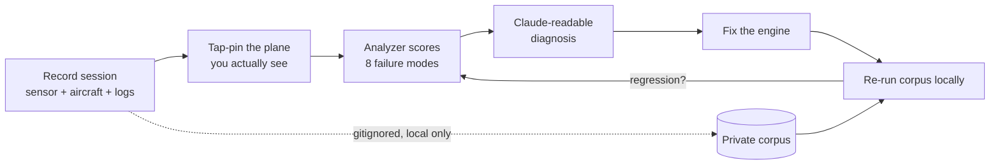

# Catch-engine feedback loop — labeled regression bench

## Summary

A local, labeled regression bench for the catch engine: record a real session (sensor + aircraft + the app's own logs), mark the plane you actually see with the existing tap-pin gesture, and an extended replay analyzer scores that session against eight failure modes and emits a Claude-readable diagnosis. The corpus stays local and private; the engine is replayed against it during development to catch regressions without waiting for live traffic. This bench *measures* the engine — it does not change it.

## Problem Frame

The catch engine — point the phone, lock onto the real plane overhead — is Bet A in `STRATEGY.md`: if the catch isn't real, the rest of the product is moot. Improving it depends on a feedback loop, and today that loop stalls in two places. First, **plane scarcity**: under quiet skies there's nothing to test against for hours or days, so iteration halts. Second, the recordings the app already makes are of **unclear value** — the capture UX is clunky and it's murky whether the sessions actually help diagnose anything. Getting files off the device is *not* the pain (Claude already pulls logs in dev).

The fix to both is the same: cheap ground-truth labels on real sessions. The only thing that produces "which plane was actually there" is the tap-pin gesture the app already has — so recorded, labeled sessions become a corpus that (a) lets the engine be iterated offline when the sky is empty, and (b) makes each recording demonstrably useful.

## Key Decisions

- **Offline corpus first; field/tester signal later.** The first build is the offline regression bench. A field "what's wrong" signal from testers reuses the same eight-mode taxonomy and is deferred, not designed away.
- **Pin-as-label.** The plane the observer taps is the ground truth; the analyzer derives the geometric failure modes from it. Field labeling cost is one tap — no mandatory per-mode tagging.
- **Local-only, private corpus.** Raw recordings, logs, and the regression corpus are gitignored and never enter the public repo. The bench runs in local development / pre-push, not in GitHub Actions.
- **Logs are in.** App logs are captured into each session because passive data needs no annotation — Noah and testers won't always stop to label, and the data must still be useful.
- **The eight-mode failure taxonomy** is the backbone, grouped into four families:

| # | Mode | Family | Ground truth source |
|---|------|--------|---------------------|
| 1 | Missed plane (visible, no label) | Detection | tap-pin with no label nearby |
| 2 | Ghost target (label on empty sky) | Detection | observer reports nothing there (field signal, later) |
| 3 | Spatial offset (label near but off the plane) | Tracking | pin-to-projected-box distance |
| 4 | Lag / staleness (label trails a moving plane) | Tracking | box vs extrapolated truth over time |
| 5 | Mis-association (caught the wrong nearby plane) | Identity | pinned A, app caught B |
| 6 | Misidentification (wrong type/airline) | Identity | out of this bench's reach — see Scope |
| 7 | Missing identity ("Unknown operator") | Identity | passively trivial (catch with nil metadata) |
| 8 | Phantom / out-of-frame capture | Validity | caught an icao never pinned/visible |

- **The number-one bar:** every signal collected must demonstrably feed Claude's ability to diagnose, fix, or regression-test the engine. Signals that don't feed that loop are not collected.

## Requirements

**Capture and labeling**

- R1. Recording a session is low-friction — it must not depend on the current debug-overlay wrench dance.
- R2. The observer marks the plane they actually see via the existing tap-pin gesture, and that pin is the session's ground-truth label. No mandatory per-mode tagging in the field.
- R3. Each session captures sensor snapshots, aircraft snapshots, and the app's own logs for that session, all retrievable together.

**Analysis and diagnosis**

- R4. The replay analyzer scores each recorded session against the eight failure modes, extending its current per-tick report.
- R5. The analyzer emits a Claude-readable diagnosis per session — which mode occurred, at which tick/plane, with the ground-truth delta — sufficient for Claude to localize a failure without re-asking the user.
- R6. Ground-truth-dependent modes are derived by comparing the tap-pin against the app's behavior; the geometric modes (missed, offset, lag, mis-association, phantom) are scored automatically from a pinned session.

**Corpus and regression**

- R7. Recorded, labeled sessions form a growing local regression corpus the catch engine is replayed against, extending the existing field-replay regression tests.
- R8. The regression suite runs in local development / pre-push, not in GitHub Actions; when corpus fixtures are absent (e.g., a CI clone), the field-replay tests skip gracefully so public CI stays green.
- R9. A regression is a session that previously scored clean on a mode now scoring that failure (or a documented intentional-miss flipping state).

**Privacy**

- R10. Raw recordings, logs, and the corpus are gitignored and never committed to the public repo.
- R11. The existing committed field-replay fixtures migrate to the local-only model — gitignored and removed from the working tree. (Full git-history scrub is deferred; see Scope.)

**Data usefulness**

- R12. Every collected signal must demonstrably feed diagnosis, fixing, or regression-testing of the engine; signals that don't are not collected.

## Acceptance Examples

- AE1. Covers R8. **Given** the corpus fixtures are absent (a fresh CI clone), **when** the suite runs in GitHub Actions, **then** the field-replay regression tests report as skipped, not failed, and the suite stays green.
- AE2. Covers R4, R6. **Given** a session where the observer tap-pinned a plane with no app label within tolerance, **when** the analyzer scores it, **then** it reports a missed-plane (mode 1) for that tick.
- AE3. Covers R6. **Given** a session where the observer pinned plane A but the app locked/caught plane B, **when** analyzed, **then** it reports mis-association (mode 5), not misidentification (mode 6).
- AE4. Covers R2, R12. **Given** a session from someone who never taps to label, **when** it is recorded, **then** it still yields useful passive signals (logs, sensor/aircraft snapshots, empty-tap diagnostics) with no annotation required.

## Scope Boundaries

**Deferred for later**

- Field/tester failure signal — the in-app "what's wrong" tap plus a PostHog dashboard. Reuses the same eight-mode taxonomy, so it adds without rework.
- A coordinate-scrubbed, shareable corpus with CI-gated regression — unnecessary under the local-only decision.
- Git-history scrub of the four already-committed fixtures — heavier, separate decision; the repo policy discourages history rewrites.

**Outside this bench's reach**

- Misidentification (mode 6) ground-truthing — the observer rarely knows the true type/airline in the field; this is a data/naming-pipeline concern covered by the naming tests, not this bench.
- Changing or fixing the catch engine itself — this measures; it does not fix.
- A synthetic ADS-B/sensor harness — it can't reproduce the real failure source (compass wobble, sensor noise, real sky).

## Success Criteria

- A single recorded session is enough for Claude to localize a failure and propose a fix without re-asking for context (the number-one bar).
- Noah can change a failure mode's behavior and confirm the corpus score improved with no live plane in view.
- A regression is caught locally before push — the loop closes without the sky.
- Field labeling costs one tap, and passive-only sessions (zero taps) still produce useful data.

## Dependencies / Assumptions

- Builds on existing replay infrastructure: the recorder already captures tap-pin, empty-tap (with nearest-plane diagnosis), and unpin events; the analyzer already reconstructs observer pose and per-tick visibility/lock state; `FieldReplayRegressionTests` and its `FieldReplays/` fixtures already exist as the regression-floor pattern.
- Assumes the app's logs can be mirrored to a retrievable file (retiring the standalone os_log-capture item, `PLAN.md` §9 #1), with no third-party logging dependency.
- The repository is public, so observer location must never be committed — the basis for the local-only/gitignore decision.
- Field testing requires Noah's iPhone; the Simulator can't supply GPS/compass/camera.

## Outstanding Questions

**Deferred to Planning**

- The low-friction recording trigger UX (how R1 is achieved).
- Per-mode derivation thresholds — what pin-to-box distance counts as offset, what tolerance counts as a miss — tuned against existing pin-protocol recordings.
- The exact shape of the Claude-readable diagnosis (R5) that is most actionable.
- How logs are captured and bundled with a session (file mirror, rotation, size bounds).
- Whether promoting a raw recording into the corpus is a manual curation step, and its mechanics.

## Sources / Research

- Grounding scan (this session), with `file:line` pointers: `ios/Tailspot/Tailspot/ReplayRecorder.swift` (tapPin/emptyTap/unpin captured; `Documents/replays/`; no in-app export), `ios/Tailspot/Tailspot/ReplayAnalyzer.swift` (per-tick report; no failure-mode scoring yet), `ios/Tailspot/Tailspot/Analytics.swift` (only `empty_sky_tap` fires today), `ios/Tailspot/TailspotTests/FieldReplayRegressionTests.swift` + `FieldReplays/` (four permanent cases), `ios/Tailspot/Tailspot/ADSBManager.swift` (tiered visibility filter), `ios/Tailspot/Tailspot/Log.swift` (os.Logger categories, no file mirror).
- `STRATEGY.md` — Real-catch engine as Bet A; catch-confirmation-rate north-star; tester-active / user-passive split.
- `PLAN.md` §9 #1 (capture os_log), §9 #8 (sustainable feedback loop), §6.3 (card-art medium — unrelated, not in scope).
