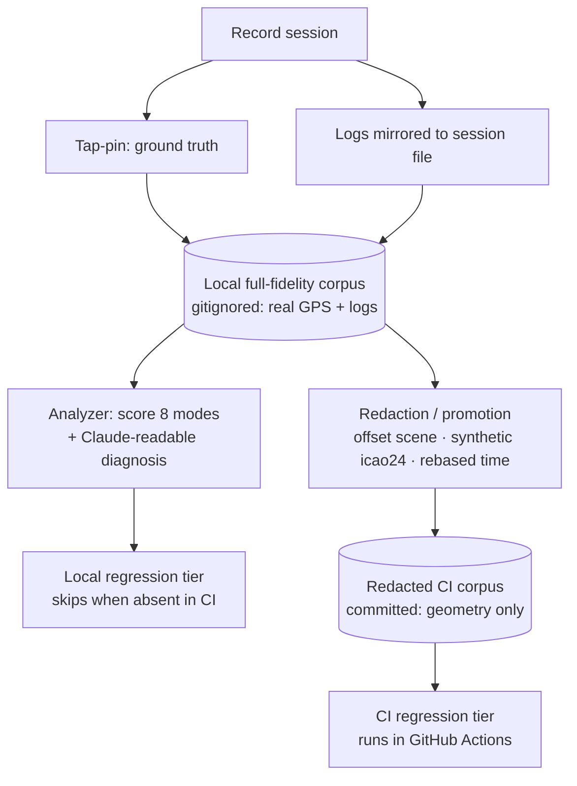

# feat: Catch-engine feedback loop — labeled regression bench

## Summary

Extend the existing replay infrastructure into a labeled regression bench: capture each session's logs, score recorded sessions against the eight failure modes, and emit a Claude-readable diagnosis. The full-fidelity corpus (real location + logs) stays local and gitignored as the broad development gate; a redaction/promotion path produces location-free fixtures that stay committed and CI-enforced as the public floor. This bench measures the catch engine — it does not change it (see origin: `docs/brainstorms/2026-06-18-catch-engine-feedback-loop-requirements.md`).

---

## Problem Frame

The catch engine is Bet A in `STRATEGY.md`, and improving it stalls on plane scarcity (no traffic, no iteration) and on recordings whose diagnostic value is unclear. The fix is cheap ground-truth labels on real sessions via the tap-pin gesture the app already records. The replay recorder already captures `tapPin` / `emptyTap` / `unpin`, and `ReplayAnalyzer` already replays each tick through the live projection/visibility code — but it stops at per-tick pose and lock state; it does not classify *failures*. `FieldReplayRegressionTests` already pins documented field misses as committed fixtures run in CI ("Identification is the product; these tests are its floor"), but it commits real GPS to a public repo. This plan closes the loop and resolves that exposure.

---

## Requirements traceability

Origin requirements (`R1`–`R12`) map to units as follows. Modes refer to the origin's eight-mode taxonomy.

- Capture: R1 → U4 (low-friction recording), R2 → existing tap-pin (no new work), R3 → U3 (logs in session).
- Analysis: R4, R6 → U1 (mode scoring); R5 → U2 (diagnosis).
- Corpus / regression: R7, R8, R10 → U5 (local corpus + gitignore + skip-gracefully); R9 → U1/U5 (regression definition); R11 → U6 (redaction + migrate existing fixtures).
- Data usefulness: R12 → cross-cutting success criterion, enforced by U2's diagnosis quality and the scope cut of any non-loop-feeding signal.

---

## Key Technical Decisions

- **KTD1 — Score offline; extend, don't replace.** Failure-mode scoring is a new session-level derivation layered on top of the existing per-tick `ReplayTickReport`, not a rewrite. The analyzer keeps emitting ticks; a new pass walks ticks + pin events and emits a `FailureModeReport`. Keeps the existing field-replay tests working unchanged.
- **KTD2 — The pin is the label; scope scoring to what a pinned replay can prove.** U1 scores the geometric modes derivable from tap-pin ground truth vs. app behavior: missed (1), spatial offset (3), lag (4), mis-association (5), phantom (8). Ghost (2) needs an empty-sky "nothing there" report and missing-identity (7) needs the resolved catch row — both deferred. Misidentification (6) has no field ground truth and stays with the naming tests (origin: Outside this bench's reach).
- **KTD3 — Logs as a per-session sidecar file.** A file-mirror on `Log.swift` writes the session's `os.Logger` output to a `.log` paired with the recording by name. Embedding log lines as JSONL events (tighter tick correlation) is deferred — the sidecar is simpler and avoids schema churn.
- **KTD4 — Two-tier corpus.** Local tier = full-fidelity recordings (real GPS + logs), gitignored, broad coverage. CI tier = redacted fixtures, committed, the public floor. Redaction offsets the whole scene (observer + all aircraft by one delta — geometry invariant), assigns synthetic `icao24`s, and rebases timestamps, **while preserving the callsign *shape*** the visibility heuristic reads (an `N`-number stays an `N`-number for the small-GA half-cap). Coordinate-offset alone is reversible via public flight history; breaking identity + time is what makes it safe.
- **KTD5 — Local tests skip when fixtures are absent.** Local-tier tests look up gitignored fixtures and report *skipped* (not failed) when they're missing, so GitHub CI stays green; the redacted CI-tier fixtures are committed and always run.
- **KTD6 — Recording stays developer-facing for now.** R1 makes the existing debug-gated recording low-friction; tester-driven recording in Release builds rides with the deferred field signal, not this plan.

---

## High-Level Technical Design

The load-bearing shape is the two-tier corpus and the redaction seam between them:

The redaction step is the only place location leaves the local boundary, and it leaves stripped. Both tiers feed the same `FailureModeReport` scorer.

---

## Implementation Units

### U1. Failure-mode scoring in the analyzer

**Goal:** Classify a recorded session against the five pin-derivable geometric failure modes, emitting a structured per-session result.

**Requirements:** R4, R6, R9.

**Dependencies:** none (recorder + analyzer already capture ticks and pin events).

**Files:** `ios/Tailspot/Tailspot/ReplayAnalyzer.swift` (extend), a new `ios/Tailspot/Tailspot/FailureMode.swift` (the eight-mode type + a `FailureModeReport`), `ios/Tailspot/TailspotTests/FailureModeScoringTests.swift` (new).

**Approach:** Add a `FailureMode` enum (all eight cases, so the schema is stable) and a `FailureModeReport` (per-session: which modes fired, at which tick, which icao24, and the ground-truth delta). Add a scoring pass over the already-ordered events + `ReplayTickReport`s that compares the pinned plane against app behavior per tick: missed = pin present, no visible label within tolerance; offset = projected box beyond a screen-distance threshold from the pin point; lag = offset growing monotonically with plane motion; mis-association = engine locked/closest is an icao other than the pinned one; phantom = a catch/lock on an icao never pinned and not visible. Reuse the existing `screenPosition` / `closestTargetIcao24` outputs already on each tick.

**Technical design (directional, not specification):** thresholds (offset px/degrees, missed tolerance) are tuned against the existing pin recordings in `FieldReplays/`, not invented here — carry them as named constants with the field data inline, mirroring the `ADSBManager` visibility constants. Exact threshold values are an execution-time tuning task (see Deferred Implementation Notes).

**Patterns to follow:** the existing `ReplayAnalyzer.analyze` event-ordering + per-tick loop; `ADSBManager` constant-with-field-data documentation style; Swift Testing in-memory `[ReplayEvent]` construction as in `ReplayAnalyzerTests.swift`.

**Test scenarios:**
- Happy path: a synthetic session where the pinned plane has a label within tolerance every tick → report has zero failure modes.
- Missed (mode 1): pinned icao present in data but `isVisible` false / no screen position within tolerance → reports missed for those ticks.
- Offset (mode 3): pinned plane visible but its projected position is beyond the offset threshold from the pin point → reports offset with the measured delta.
- Mis-association (mode 5): pin on icao A, but `closestToCenterIcao24` / lock resolves to icao B while A is also visible → reports mis-association (A expected, B actual), not misidentification.
- Phantom (mode 8): a tick where the engine locks an icao that was never pinned and is below the visibility predicate → reports phantom.
- Edge: a session with no pin events → no geometric-mode claims (nothing to compare against), report is empty, not a crash.
- Edge: ticks before the first GPS fix (no observer) → skipped from scoring, not scored as missed.

**Verification:** the new report type is populated for each scenario above with the correct mode, tick index, icao24, and delta; existing `ReplayAnalyzerTests` and `FieldReplayRegressionTests` still pass unchanged.

### U2. Claude-readable diagnosis output

**Goal:** Turn a `FailureModeReport` into a compact, localized diagnosis a Claude session can act on without re-asking for context.

**Requirements:** R5, R12.

**Dependencies:** U1.

**Files:** `ios/Tailspot/Tailspot/ReplayAnalyzer.swift` (extend the `describe()` area or add a `diagnose()`), `ios/Tailspot/TailspotTests/ReplayDiagnosisTests.swift` (new).

**Approach:** Add a diagnosis formatter that summarizes, per session: the modes that fired, the worst offender (tick + icao + delta), and the observer/aircraft context for that tick — enough to localize *where* and *what*, not the whole tick dump. Output is plain text suited to a terminal or a debug viewer, consistent with the existing `describe()`. This is the surface the #1 data-usefulness bar is judged against.

**Patterns to follow:** the existing `ReplayReport.describe()` monospaced formatter (fixed-width rows, two-level indent).

**Test scenarios:**
- Happy path: a clean session → diagnosis states "no failure modes" succinctly.
- A session with one offset and one mis-association → diagnosis names both modes, the tick offset (seconds), the icao24s, and the deltas.
- Determinism: the same report produces byte-identical diagnosis text across runs (no clock/locale leakage).
- Empty/cut-short session (no ticks) → diagnosis degrades to a one-line "no ticks" rather than crashing (mirrors `describe()`).

**Verification:** the diagnosis names every fired mode with its locating detail; a reviewer can point to the failing tick from the text alone.

### U3. Capture session logs into the recording

**Goal:** Mirror the session's `os.Logger` output to a retrievable file paired with the replay, so a recording carries app logs (retires `PLAN.md` §9 #1).

**Requirements:** R3, R12.

**Dependencies:** none.

**Files:** `ios/Tailspot/Tailspot/Log.swift` (add a file-mirror sink), `ios/Tailspot/Tailspot/ReplayRecorder.swift` (open/close the log file alongside the JSONL), `ios/Tailspot/TailspotTests/LogCaptureTests.swift` (new).

**Approach:** Add a lightweight file sink that mirrors log lines to `Documents/replays/replay-<utc>.log` for the active recording window, started/stopped with the recorder. Keep it append-only and crash-tolerant (a partial tail is fine, mirroring the JSONL decoder's tolerance). The sink is a mirror, not a replacement — `os.Logger` calls are unchanged at call sites.

**Technical design (directional):** mirror at the `Log` layer rather than intercepting unified logging, so no private frameworks. Bound the file (size or line cap) so a long session can't fill the container.

**Test scenarios:**
- Happy path: with capture active, emitted log lines appear in the session `.log` file in order.
- The file pairs with the recording (same `<utc>` stem) and lives under `Documents/replays/`.
- Capture off → no file written, and `os.Logger` still emits normally.
- Size bound: exceeding the cap truncates/rotates rather than growing unbounded.
- Crash tolerance: a partially written file is still readable line-by-line.

**Verification:** a recorded session yields a paired, ordered, bounded log file retrievable via the same `Documents/` path; no behavior change when capture is off.

### U4. Low-friction recording trigger

**Goal:** Make starting/stopping a recording a one-tap, clearly-stated action instead of the current debug-overlay wrench dance.

**Requirements:** R1.

**Dependencies:** U3 (so the trigger starts log capture too).

**Files:** `ios/Tailspot/Tailspot/ContentView.swift` (recording control + state), debug overlay area.

**Approach:** Surface a single clearly-labeled record toggle with an unambiguous recording-active indicator, still developer-facing (debug-gated) per KTD6. One tap starts the JSONL recorder *and* the log sink (U3); one tap stops both. No Release-build/tester surface in this plan.

**Test scenarios:** `Test expectation: none — UI control wiring; the recorder/sink behavior it triggers is covered by U3 and existing `ReplayRecorderTests`.` Verify by manual device check: tap starts, indicator shows active, tap stops, paired `.jsonl` + `.log` exist.

**Verification:** on device, recording is start/stoppable in one tap with a visible active state, and produces the paired files.

### U5. Local full-fidelity corpus + gitignore + skip-gracefully

**Goal:** Establish the local, gitignored full-fidelity corpus and make local-tier regression tests skip (not fail) when their fixtures are absent, so GitHub CI stays green.

**Requirements:** R7, R8, R10.

**Dependencies:** U1.

**Files:** `.gitignore` (add the local corpus path), a new `ios/Tailspot/TailspotTests/LocalReplays/` convention (gitignored) + `ios/Tailspot/TailspotTests/FailureModeRegressionTests.swift` (new, local-tier, skips when absent), the `loadReplay` bundle-hook pattern.

**Approach:** Define a local corpus directory that is gitignored (the existing `.gitignore` already excludes `/replays/`, `pulled-replays/`, `*.log` — add the local corpus path in the same spirit). The local-tier test suite resolves fixtures and, when a fixture is absent (the gitignored corpus isn't on a fresh CI clone), records a *skip* rather than a `#require` failure. The full-fidelity corpus is where broad failure-mode regression cases live during development.

**Technical design (directional):** Swift Testing expresses "skip when absent" via a guarded early return that records a skip/known-condition rather than failing the `#require`. Keep the bundle-hook loader (`Bundle(for:)`) shape from `FieldReplayRegressionTests`.

**Test scenarios:**
- Covers AE1. Fixture absent (simulating a CI clone) → the local-tier test reports skipped, not failed; the overall suite stays green.
- Fixture present (local) → the test loads it and asserts its expected failure-mode scores.
- `.gitignore` excludes the local corpus path (a recording dropped there is untracked by git).

**Verification:** `git status` shows local corpus recordings untracked; running the suite with fixtures absent yields skips + green; with fixtures present, real assertions run.

### U6. Redaction/promotion path + redacted CI tier

**Goal:** Promote a chosen recording into a committed, location-free CI fixture, and migrate the existing five fixtures through the same path so they stop leaking.

**Requirements:** R11, R7, R8.

**Dependencies:** U1, U5.

**Files:** a new redaction transform `ios/Tailspot/Tailspot/ReplayRedaction.swift` (pure, testable), `ios/Tailspot/TailspotTests/ReplayRedactionTests.swift` (new), the existing committed fixtures under `ios/Tailspot/TailspotTests/FieldReplays/` (replaced with redacted versions), `FieldReplayRegressionTests.swift` (update icao references to the synthetic ids).

**Approach:** A pure transform that takes a decoded `[ReplayEvent]` and returns a redacted copy: offset observer + all aircraft by one delta (geometry invariant), assign stable synthetic `icao24`s, rebase timestamps to a relative epoch, and rewrite callsigns to break identity *while preserving shape* (an `N`-number stays an `N`-number so the small-GA visibility half-cap still fires). Re-promote the existing five `FieldReplays/` fixtures through it (updating the test assertions to the synthetic ids), so the committed CI tier carries geometry only. New high-signal cases are promoted the same way.

**Execution note:** Start with a characterization test asserting that redaction leaves every `isVisible` / `screenPosition` result identical to the original on the existing fixtures — the redaction is only correct if the geometry it feeds the analyzer is unchanged.

**Technical design (directional):** the offset is computed per-recording from the first observer fix; synthetic icao mapping is a stable per-fixture dictionary; callsign rewrite keys off the existing N-number heuristic so the shape that drives visibility is preserved.

**Test scenarios:**
- Covers AE2/AE3 indirectly via geometry-invariance: redacting a fixture leaves every aircraft's `isVisible` and `screenPosition` identical to the un-redacted run (the load-bearing safety property).
- Identity broken: no real `icao24`, real callsign, or real timestamp survives in the redacted output.
- Shape preserved: a GA `N`-number input yields a synthetic `N`-number (the small-GA half-cap still applies); an airline callsign yields a synthetic airline-shaped callsign.
- Location broken: observer coordinates are offset; the offset cannot be recovered from the output alone (no real callsign/timestamp to cross-reference).
- Migration: each of the five existing fixtures, redacted, still passes its `FieldReplayRegressionTests` assertion (visibility outcome unchanged) under its synthetic id.
- Determinism: redacting the same input twice yields identical output (stable synthetic mapping).

**Verification:** the committed `FieldReplays/` fixtures contain no real location/identity/time; all field-replay assertions still pass against the redacted fixtures in GitHub CI; the geometry-invariance test is green.

---

## Scope Boundaries

### Deferred for later

- Field/tester failure signal — the in-app "what's wrong" tap plus a PostHog dashboard. Reuses the eight-mode taxonomy, so it adds without rework.
- Scoring mode 2 (ghost) and mode 7 (missing identity) — ghost needs an empty-sky report; missing-identity needs the resolved catch row, not the replay. Both deferred.
- Tester-driven recording in Release builds.
- Embedding log lines as JSONL events (tighter tick correlation) — sidecar file ships first.

### Outside this bench's reach

- Misidentification (mode 6) ground-truthing — a data/naming-pipeline concern, covered by the naming tests, not this bench.
- Changing or fixing the catch engine itself — this measures; it does not fix.
- A synthetic ADS-B/sensor harness — it can't reproduce the real failure source.

### Deferred to Follow-Up Work

- Git-history scrub of the five already-committed fixtures. Redaction stops *future* exposure and removes location from the working tree; the prior commits remain in history, and a history rewrite is a separate, heavier decision the repo's policy discourages.

---

## Success Criteria

- A single recorded session's diagnosis (U2) is enough for Claude to localize a failure and propose a fix without re-asking — the #1 bar (R12).
- A failure mode can be changed and the corpus score confirmed improved with no live plane in view.
- A regression is caught locally before push; the redacted high-signal subset is caught in GitHub CI.
- Field labeling costs one tap; passive-only sessions (zero taps, logs + sensor only) still produce useful data.

---

## Risks & Dependencies

- **Redaction reversibility** (the load-bearing privacy risk): coordinate-offset alone is reversible via public flight history. Mitigated by breaking identity (synthetic icao + callsign) and rebasing timestamps — tested in U6.
- **Redaction breaking test validity:** offsetting the scene must not change geometry. Mitigated by the geometry-invariance characterization test (U6 execution note).
- **Logs carrying sensitive context:** session logs may include location-adjacent strings; mitigated because logs are gitignored (local tier) and stripped from CI fixtures (redaction drops the sidecar).
- **Threshold tuning** for the geometric modes depends on the existing pin recordings; values are execution-time, not plan-time.

---

## Deferred Implementation Notes

- Exact failure-mode thresholds (offset px/degrees, missed tolerance, lag growth criterion) — tuned against `FieldReplays/` pin recordings during U1, documented inline as constants.
- The precise synthetic-id and callsign-shape rewrite scheme — settled in U6 against the real fixtures; only the invariants (geometry preserved, identity/time/location broken, N-number shape kept) are fixed here.
- Log file size/rotation bound (U3) — a concrete cap chosen during implementation.
