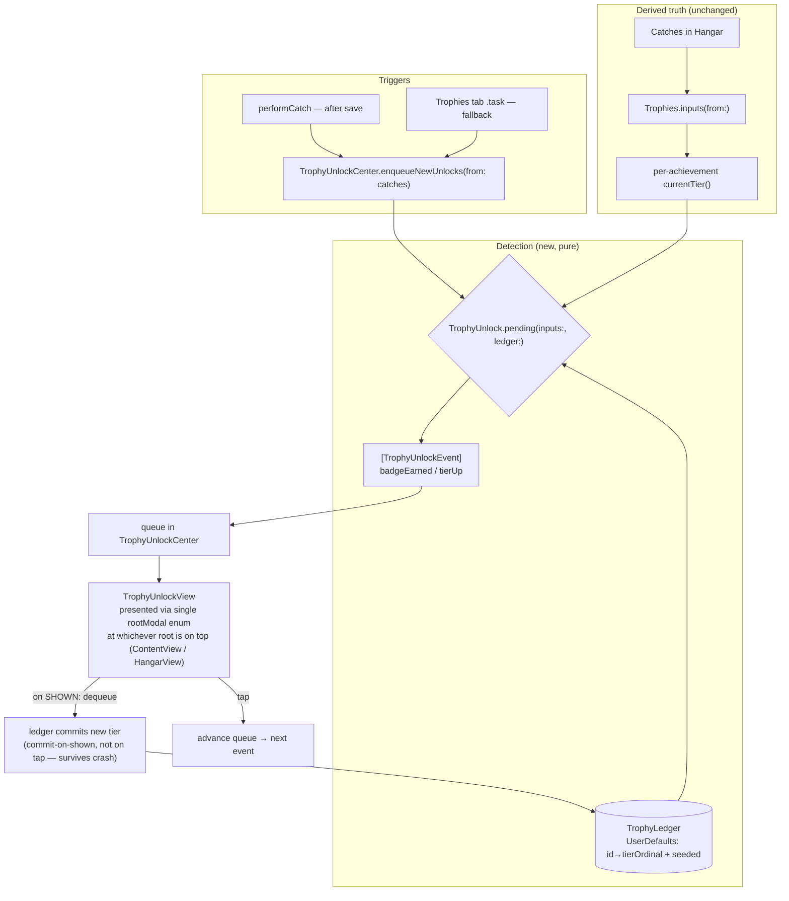

# feat: Trophies cleanup, hidden trophies, and unlock moments

**Created:** 2026-06-20
**Deepened:** 2026-06-20 (6-persona doc review: coherence, feasibility, design-lens, scope-guardian, adversarial, product-lens)
**Type:** feat
**Depth:** Standard
**Surface:** Hangar → Trophies tab (`ios/Tailspot/Tailspot/`), plus the catch-save path in `ContentView`.

---

## Summary

Make trophies feel alive. Today the Trophies tab is a derived, static read-out — it recomputes earned state from the Hangar on every render and never tells you the *instant* you earn something. This plan adds three things and cleans up a fourth:

1. **An unlock moment.** A persisted "acknowledged-tier" ledger lets us detect a trophy *crossing* (not just its current state), so a newly-earned trophy triggers a full-screen celebration chained off the catch reveal — with a tab-open fallback for anything earned out-of-band.
2. **Hidden trophies.** New fun, deliberately hard-to-earn awards that render as a mystery `???` placeholder until earned, then reveal their real name in the moment. A `trophy_unlocked` PostHog event fires on each unlock.
3. **A multi-country trophy** (Mr. Worldwide) — catch planes while standing in 2+ countries, using a new reverse-geocoded `country` on each catch.
4. **Roster + visual cleanup.** Fix the one fully-dead trophy (Long Lens), retire the two multi-catch-dependent trophies (Constellation, Quintet) to **hidden-dormant** until the multi-catch mechanic ships, and run a device polish loop on the jank in the cards.

Trophy *truth* stays derived (no drift). The only new persisted state is device-local UI acknowledgment, **one** additive optional `Catch` field (`country`), and a small `UserDefaults` ledger. The deeper **medal/points/rareness system rework** Noah flagged is explicitly *out of scope* this round — tracked as PLAN.md §9 #10; here we do only the trophy-surface cleanup.

---

## Problem Frame

The trophy system (`ios/Tailspot/Tailspot/Trophies.swift`) is a pure function over the Hangar: `Trophies.inputs(from:catches)` produces a `TrophyProgressInputs` totals struct, and each `Achievement` derives its current tier from those totals. This is clean and testable, but it has three consequences this plan addresses:

- **No notion of "new."** Because state is recomputed every render, the app cannot distinguish "you have always had this" from "you just earned this." There is no acknowledgment record, so an unlock moment is impossible today.
- **Some trophies can never be earned.** `Long Lens` caps its progress at `0/1` but defines silver@5 / gold@15 — the upper tiers are unreachable. `Constellation` and `Quintet` read `bestMultiCatchCount`, which `inputs(from:)` hardcodes to `0` — they are permanently locked. These are the "jank" in the roster itself.
- **Locked state is flat.** Every locked award is an identical dashed hex + padlock. There is no hook for hidden/secret awards and no celebration of progress.

There is no upstream brainstorm doc for this work (the only recent requirements doc, `docs/brainstorms/2026-06-18-catch-engine-feedback-loop-requirements.md`, is the catch-engine bench — unrelated). Scope was confirmed interactively (see Key Technical Decisions).

---

## Scope Boundaries

### In scope
- The Trophies tab and its data model: `Trophies.swift`, `HangarTrophiesView.swift`, `TrophyView.swift`.
- A persisted unlock ledger + pure diff engine + a celebration overlay + a one-time "trophy case" recap on first launch after this update.
- New hidden trophies (incl. the Mr. Worldwide country trophy) with their metrics.
- One additive `Catch` field (`country`) and the reverse-geocode country extractor.
- A `trophy_unlocked` PostHog event via the existing `Analytics.swift` REST pipeline.
- A polish/jank pass on the Trophies surface via the device loop.

### Deferred to follow-up work
- **Backend/leaderboard trophy sync.** The ledger is device-local; cross-device sync waits for the backend (PLAN.md §1).
- **`multiCatchSize` + Constellation/Quintet earnability.** Wiring these to a real frame count ships with the multi-catch AR mechanic (PLAN.md §9 #5); this round retires them to hidden-dormant.
- **Scoring/points/rareness + medal-tier-logic rework** — tracked as PLAN.md §9 #10 (added this round).
- **Notification on unlock when app is backgrounded.** Out of scope; the moment is in-app only.
- **Leveling Mr. Worldwide beyond the badge** (2→5→10 countries as a medal) — easy later extension; ships as a one-shot badge first.

### Non-goals
- Sets and Recent tabs, app-wide visual rework.
- **The medal tier/threshold *system*, points-per-catch clarity, and rareness bucketing** — Noah flagged these as wonky and wanting a dedicated rework (PLAN.md §9 #10). This round does only surface cleanup of the trophy cards, not a logic overhaul of the scoring/medal model.
- Changing trophy *truth* to a persisted store — earned state stays derived.

---

## Key Technical Decisions

**KTD-1 — The ledger records *acknowledgment*, not truth.** Trophy earned-state stays derived from catches. The new persisted state is a device-local record of the highest tier the user has already been *shown* per achievement. Current-vs-acknowledged is the entire unlock signal. This keeps the no-drift property the original design valued (see `Trophies.swift` header) while making "new" detectable. *(Confirmed fork: full-screen celebration over a lighter toast.)*

**KTD-2 — `UserDefaults`, not SwiftData, for the ledger — and a concrete type, not a protocol.** The ledger is a small `[achievementID: tierOrdinal]` map + a `seeded` flag — device-local UI state, single-user, no migration risk, no sync need (backend is future). A JSON blob in `UserDefaults` is the simplest viable choice (CLAUDE.md: simplest iOS choice at every fork); SwiftData would add a migration for no benefit. **No `TrophyLedger` protocol or in-memory double** — a single-device app with one write path doesn't earn the abstraction (scope-guardian). `UserDefaultsTrophyLedger` is a concrete struct; tests inject it constructed against an isolated `UserDefaults(suiteName:)` rather than `.standard`, which gives full test isolation without a protocol layer.

**KTD-3 — Seed the ledger silently on first run — synchronously, in `init`.** An existing tester has up to hundreds of catches; an empty ledger would fire a flood of celebrations on the first launch after this update. **Seeding completes synchronously inside `TrophyUnlockCenter.init` (guarded by the `seeded` flag), never lazily inside `enqueueNewUnlocks`.** This ordering is load-bearing: the paged `TabView` mounts all three Hangar pages eagerly (`HangarView.swift:163`, "keeps every segment alive"), so the Trophies-tab fallback `.task` fires the instant the Hangar sheet opens — a tester who updates and immediately opens the Hangar would hit `enqueueNewUnlocks` against an unseeded ledger and flood. Because the center is constructed at the app root *before* any tab mounts, seed-in-init guarantees the first diff runs against a seeded ledger. `enqueueNewUnlocks` asserts `ledger.isSeeded`. Only crossings *after* the update produce moments. Explicitly tested (U5).

**KTD-3a — One-time "trophy case" recap on first launch after update (Noah).** Silent seeding means existing testers would otherwise get *no* moment on this update. To make them aware the feature exists, the first seed that finds ≥1 already-earned trophy enqueues a single **recap** presentation ("Your Trophy Case — N medals · M badges"), shown once and gated by a separate `recapShown` flag. This is one summary moment, **not** a per-trophy flood. Future organic crossings then fire individual moments as normal.

**KTD-4 — Country = where the observer stood.** A new `Catch.country` is reverse-geocoded from `observerLat/observerLon`, exactly like `placeName` already is, and `distinctCountries` counts non-empty values. This is a traveler achievement, needs no new data source, and reuses the established fill-if-nil backfill. *(Confirmed fork: observer country over aircraft origin-country.)* Country identity prefers a stable ISO code; see Open Questions for the exact MapKit field.

**KTD-5 — One unified root modal; present the moment at the layer that's actually on top.** Two coupled SwiftUI traps surfaced in review:

- **Sibling `fullScreenCover`s don't chain reliably (adversarial).** The catch reveal is already a root `.fullScreenCover(item: $pendingReveal)` (+ a second for `$pendingMultiReveal`). Adding the celebration as a *third* parallel cover "gated on the others being nil" races the dismissal animation against the gating-state flip, and SwiftUI frequently drops the new cover. **Resolution: collapse all three into one `rootModal` item enum (`.reveal | .multiReveal | .celebration`) presented by a single `fullScreenCover(item:)`.** SwiftUI serializes transitions on one item binding, so the reveal→celebration hand-off is a single binding change (set on the reveal's `onDismiss`), not a two-cover race.
- **A root cover can't present above the Hangar sheet (adversarial).** The Hangar is itself a `.sheet` over `ContentView` (`ContentView.swift:512`). When the tab-open fallback discovers a crossing *while the user is in the Trophies tab*, a `ContentView`-root modal is occluded by the Hangar sheet — the event queues but nothing shows. **Resolution: the fallback presents the celebration at the `HangarView` root** (still outside the `TabView` page, per the recorded `[[lesson_navdest_not_in_tabview]]`); the catch-flow path presents at the `ContentView` root. The center exposes `pendingEvents`; both roots observe it and present at whichever layer is currently on top. The catch-flow root still gates on "no reveal showing" (now automatic via the single `rootModal` enum).

**KTD-6 — Hidden trophies are visible-but-masked.** Hidden+locked awards still occupy a card and count toward the section total ("BADGES 4/9"), but render `???` + a teaser instead of name/criteria. This signals there is more to discover (the chosen "mystery placeholder" treatment) without spoiling it. The masking is a pure presentation helper so it is unit-testable.

**KTD-7 — Make the dead trophies honest, the cheap way.** `Long Lens` repoints to a new `farCatchCount` metric (catches ≥ **25 km** — reachable *within* the `< 30 km` visibility window, but still rare; Noah likes hard awards). `Constellation`/`Quintet` depend on multi-catch frames that don't reliably occur in the shipping build, so rather than add a `Catch` field for a capability still on the backlog (PLAN.md §9 #5), this round retires them to **hidden-dormant** (`hidden: true` → `???` mystery cards). They stop reading as visibly-locked-forever now, and light up when the multi-catch mechanic + a real `bestMultiCatchCount` ship together. Net: no `Catch` schema change, no permanently-dead card.

---

## High-Level Technical Design

The unlock path is a single pure diff (`current earned-state` vs `ledger`) consumed by two triggers — the catch flow and the tab open — and one presenter.

**Why two triggers, one diff:** `performCatch` is the *moment* path. But `country`/`placeName` are reverse-geocoded *after* the catch reveal dismisses (see `ContentView.swift:989`), so a country crossing can tick over late; and a new build can retroactively unlock existing catches. The tab-open `.task` re-runs the same `pending()` so nothing slips through. Because `pending()` diffs against the ledger and `acknowledge()` commits, an event shown via the moment is never re-shown by the fallback.

**New components:**

| Component | File | Role |
|---|---|---|
| `UserDefaultsTrophyLedger` (concrete struct, suite-injectable) | `TrophyLedger.swift` | Persist acknowledged tier per achievement + `seeded` flag |
| `TrophyUnlockEvent`, `TrophyUnlock.pending(...)`, `TrophyUnlock.seed(...)` | `TrophyUnlock.swift` (pure free functions; may live alongside the roster in `Trophies.swift` if preferred) | Pure diff: current earned-state vs ledger → events |
| `TrophyUnlockCenter` (`@MainActor`, observable) | `TrophyUnlockCenter.swift` | Owns the queue + ledger; seeds in `init`; `enqueueNewUnlocks`, `markShown` (commit-on-shown), `advance` |
| `TrophyUnlockView` | `TrophyUnlockView.swift` | Full-screen celebration overlay (hex zoom/shine, tier color, `???`→name reveal for hidden, haptic, a11y) |
| `TrophyCardPresentation` (pure helper) | `HangarTrophiesView.swift` | Resolves displayed `title` / `subtitle` / `accessibilityLabel` (handles `???` masking) — unit-testable |

---

## Implementation Units

### U1. Roster cleanup + `hidden`/`teaser` model affordance

**Goal:** Add the model fields hidden trophies need, and make the existing roster honest, without touching detection or UI yet.

**Requirements:** "clean up the trophies/badges"; foundation for hidden trophies.

**Dependencies:** none.

**Files:**
- `ios/Tailspot/Tailspot/Trophies.swift` (modify)
- `ios/Tailspot/TailspotTests/TrophiesTests.swift` (modify)

**Approach:**
- Add `let hidden: Bool` (default `false` in the `Achievement` init) and `let teaser: String?` (default `nil`) to `Achievement`. Defaults keep every existing roster entry compiling unchanged.
- Audit existing titles/summaries for consistency (terse, sentence-case summaries; mono-caps labels stay in the views).
- Leave the actual fix of `Long Lens` / `Constellation` / `Quintet` to U4 (it needs the new metrics) — but add a failing/pending note in tests so the gap is visible. Do **not** silently keep unreachable tiers.

**Patterns to follow:** the `Achievement` Sendable-closure shape (`Trophies.swift:73`); defaulted-init back-compat pattern already used for `TrophyProgressInputs` (`Trophies.swift:122`).

**Test scenarios:**
- `hidden` defaults to `false` and `teaser` to `nil` for every existing roster entry (guards against accidental masking of a normal trophy).
- Roster IDs remain unique (extend existing `rosterIsNotEmptyAndHasUniqueIDs`).
- Adding the two fields does not change any existing `currentTier`/`nextTier` result (existing tests still pass).

**Verification:** `xcodebuild test -only-testing:TailspotTests` green; no roster entry is accidentally `hidden`.

---

### U2. Persisted unlock ledger + pure diff engine

**Goal:** The detection core — persist acknowledged tiers and compute newly-unlocked events as a pure function.

**Requirements:** "make unlocking a trophy an actual moment" (the detection half).

**Dependencies:** U1.

**Files:**
- `ios/Tailspot/Tailspot/TrophyLedger.swift` (create)
- `ios/Tailspot/Tailspot/TrophyUnlock.swift` (create)
- `ios/Tailspot/TailspotTests/TrophyUnlockTests.swift` (create)

**Approach:**
- `UserDefaultsTrophyLedger` — a **concrete struct** (no protocol, no in-memory double; see KTD-2): `acknowledgedOrdinal(for id: String) -> Int` (−1 = none), `setAcknowledged(_ ordinal: Int, for: String)`, `isSeeded`/`markSeeded()`. Stores a `[String:Int]` JSON blob + a `Bool` under namespaced keys in an injected `UserDefaults` (default `.standard`; tests pass `UserDefaults(suiteName:)`).
- `TrophyUnlockEvent`: `{ achievementID, achievement, newTier: TrophyTier, kind: .badgeEarned | .tierUp }`. Tier ordinal uses `TrophyTier.allCases.firstIndex` (bronze=0…platinum=3).
- `TrophyUnlock.pending(inputs:, roster:, ledger:) -> [TrophyUnlockEvent]`: for each achievement, compute `currentTier`; if its ordinal `>` the ledger's acknowledged ordinal, emit one event at the *current* tier (collapse multi-tier jumps to a single event at the highest reached). Deterministic order (roster order). Pure — no side effects.
- Seeding helper `TrophyUnlock.seed(inputs:, roster:, into ledger:)`: writes each currently-earned tier as acknowledged and `markSeeded()`, emitting nothing.

**Patterns to follow:** pure/`Sendable` style of `Trophies.swift`; the synthetic-`mk` catch builder in `TrophiesTests.swift:26` for fixtures.

**Test scenarios:**
- `pending` returns empty when ledger ordinals equal current earned-state.
- Medal crossing bronze→silver (acknowledged=bronze, current=silver) yields exactly one `.tierUp` event at silver.
- A badge going locked→earned (acknowledged=none) yields one `.badgeEarned` event; a still-locked badge yields none.
- A two-tier jump in one step (acknowledged=none, current=gold) collapses to a single event at gold (not three).
- Two trophies crossed by the same inputs delta yield two events in roster order.
- **Seeding:** fresh (unseeded) ledger + non-empty catches → after `seed`, `pending` is empty, `isSeeded` is true, and every currently-earned tier is acknowledged.
- `acknowledge` (via `setAcknowledged`) of an event makes a subsequent `pending` omit it.
- Defensive: a lower current tier than acknowledged (shouldn't happen) emits no event and never a negative ordinal.

**Verification:** all `TrophyUnlockTests` green; `UserDefaultsTrophyLedger` round-trips through a custom suite name so it never touches `standard`.

---

### U3. `Catch.country` + reverse-geocode country

**Goal:** Persist a reverse-geocoded `country` on each catch, the metric Mr. Worldwide needs.

**Requirements:** multi-country trophy (Mr. Worldwide).

**Dependencies:** none (parallel to U2).

**Files:**
- `ios/Tailspot/Tailspot/Catch.swift` (modify)
- `ios/Tailspot/Tailspot/ReverseGeocode.swift` (modify)
- `ios/Tailspot/Tailspot/ContentView.swift` (modify — stamp at catch time)
- `ios/Tailspot/Tailspot/CatchDetailView.swift` (modify — backfill)
- `ios/Tailspot/TailspotTests/ReverseGeocodeTests.swift` (create or extend)

**Approach:**
- Add `var country: String?` to `Catch` — **optional, no required-init change** (SwiftData lightweight migration; CLAUDE.md additive-only rule). Existing tester rows decode as `nil`. *(`multiCatchSize` is deferred with Constellation/Quintet — KTD-7 — so no other schema change.)*
- `country`: add `ReverseGeocode.country(lat:lon:) async -> String?` returning a **stable** key (prefer ISO country code; fall back to country display name — see Open Questions). In the existing post-save geocode task (`ContentView.swift:989`) stamp `country` alongside `placeName` in the same pass (one geocode, both fields). In `CatchDetailView`'s nil-only backfill, add `country` to the fill-if-nil set next to `placeName` (it is a property of the moment's location, same rules — never overwrite).
- Keep the `MainActor`/nil-tolerant contract: country failure → leave nil, retry on a later open.

**Patterns to follow:** `placeName` backfill at `ContentView.swift:989-997` and the `CatchDetailView` fill-if-nil exception (CLAUDE.md "Catch flow + SwiftData"); `ReverseGeocode.format` pure tail (`ReverseGeocode.swift:65`).

**Test scenarios:**
- A `Catch` built via the public init without the new arg defaults `country` to `nil` (migration shape; no crash).
- Pure country-parse/fallback: a placemark with an ISO code yields that code; missing ISO falls back to the country name; empty → nil (mirror the `format` tests).
- Backfill never overwrites a non-nil `country` (fill-if-nil only).

**Verification:** existing Catch/Hangar tests stay green (additive migration); a fresh catch in the sim/device records `country` after geocode resolves.

---

### U4. New hidden trophies + metric aggregation (incl. dead-trophy fixes)

**Goal:** Add the fun hidden awards (incl. the Mr. Worldwide country trophy) and their metrics; repoint Long Lens to a reachable metric; retire Constellation/Quintet to hidden-dormant.

**Requirements:** "more fun trophies hidden by default"; "one specific new trophy for catching planes in >1 country"; roster cleanup.

**Dependencies:** U1 (model fields), U3 (`country`).

**Files:**
- `ios/Tailspot/Tailspot/Trophies.swift` (modify — `TrophyProgressInputs` + `inputs(from:)` + roster)
- `ios/Tailspot/TailspotTests/TrophiesTests.swift` (modify)

**Approach — new metrics on `TrophyProgressInputs`** (all defaulted in the init for back-compat, same pattern as the 2026-06-16 expansion at `Trophies.swift:113`):
- `distinctCountries` — distinct non-empty `country`.
- `farCatchCount` — a **new accumulator** in the `inputs(from:)` loop (`far += 1` when `slantDistanceMeters / 1000 ≥ 25`), distinct from the existing `longestSlantKm` running-max. The 25 km bound sits *inside* the `< 30 km` visibility window so far catches actually register, while staying rare. *(`bestMultiCatchCount` stays the hardcoded `0` — Constellation/Quintet are dormant this round, KTD-7.)*
- `redEyeCatches` — catches whose hour ∈ [2,5).
- `bestBurstWithinTenMin` — **two-pointer sweep** over sorted `caughtAt`: advance the window start `i` while `caught[j] - caught[i] > 600 s`, track `max(j - i + 1)`. "Any 10-min window" means *each catch is a candidate window start*, NOT fixed 10-min buckets (bucketing under-counts a burst spanning a boundary). O(n log n) sort + O(n) sweep — never the naïve O(n²) neighbor-count, since this runs inside the per-render `inputs(from:)`.
- `hasRepeatAirframeAcrossDays` — any `icao24` caught on ≥2 distinct calendar days.
- `longestDayStreak` — longest run of consecutive calendar days with ≥1 catch.

**Calendar consistency (adversarial):** all new day/hour metrics reuse the single `Calendar(identifier: .gregorian)` local the existing `inputs(from:)` already constructs (`Trophies.swift:380`) — **not** `Calendar.current`. Mixing the two would let `longestDayStreak` and the existing `distinctDays` disagree on day boundaries for a traveling (timezone-crossing) user.

**Approach — roster changes:**
- **New hidden trophies** (`hidden: true`, with teasers) — all one-shot **badges**, deliberately hard/rare (Noah's preference); no new medals while the medal system is pending rework (PLAN.md §9 #10):
  - `mrworldwide` — *Mr. Worldwide* (badge): `distinctCountries ≥ 2`. Teaser: "Catch under more than one flag." (The explicit ">1 country" ask.)
  - `hattrick` — *Hat Trick* (badge): `bestBurstWithinTenMin ≥ 3`. Teaser: "Three in a hurry."
  - `redeye` — *Red Eye* (badge): `redEyeCatches ≥ 1`. Teaser: "Caught something at a strange hour."
  - `repeat` — *Repeat Customer* (badge): `hasRepeatAirframeAcrossDays`. Teaser: "Some planes come back around."
  - `streak` — *Streak* (badge, one-shot): `longestDayStreak ≥ 7`. Teaser: "Keep showing up."
- **Dead-trophy handling (KTD-7):** repoint `Long Lens` progress to `farCatchCount` (tiers 1/5/15 now reachable at ≥25 km). Mark `Constellation` and `Quintet` `hidden: true` (dormant `???` cards) — they keep reading the hardcoded-`0` `bestMultiCatchCount` until the multi-catch mechanic ships (PLAN.md §9 #5).

**Patterns to follow:** the single-pass aggregation in `inputs(from:)` (`Trophies.swift:370`); the curated-roster table style; defaulted-init back-compat.

**Test scenarios:**
- Each new metric: `distinctCountries` (US+CA→2, nil ignored); `farCatchCount` (26 km counts, 24 km doesn't); `redEyeCatches` (03:00 counts, 12:00 doesn't — construct dates against the same gregorian calendar the production loop uses, as the existing night test does at `TrophiesTests.swift:107`); `bestBurstWithinTenMin` with **boundary cases**: catches at t=0/8min/9min → 3; t=0/6min/12min → 2 (proves the sliding window, not buckets); `hasRepeatAirframeAcrossDays` (same icao two days → true; twice same day → false); `longestDayStreak` (7 consecutive → 7; gap breaks it).
- `Mr. Worldwide` locked at 1 country, earned at 2; `hidden == true`.
- `Streak` earns at a 7-consecutive-day run; locked at 6; `hidden == true`.
- `Long Lens` now climbs to silver/gold with ≥5 / ≥15 catches at ≥25 km (regression guard on the fix).
- `Constellation` and `Quintet` are `hidden == true` and remain locked (dormant) under the hardcoded-`0` `bestMultiCatchCount`.
- Roster IDs still unique; all five new awards carry a non-nil `teaser`; the dead-trophy handling doesn't break any existing tier test.

**Verification:** full `TrophiesTests` green; no *visible* (non-hidden) trophy in the roster has an unreachable top tier.

---

### U5. `TrophyUnlockCenter` + the celebration overlay

**Goal:** Own the unlock queue + ledger and build the full-screen "moment."

**Requirements:** "make unlocking a trophy an actual moment that is acknowledged in the app."

**Dependencies:** U2 (diff + ledger), U4 (roster).

**Files:**
- `ios/Tailspot/Tailspot/TrophyUnlockCenter.swift` (create)
- `ios/Tailspot/Tailspot/TrophyUnlockView.swift` (create)
- `ios/Tailspot/TailspotTests/TrophyUnlockCenterTests.swift` (create)

**Approach:**
- `TrophyUnlockCenter` (`@MainActor`, `@Observable`): holds `pendingEvents: [TrophyUnlockEvent]` and a `UserDefaultsTrophyLedger`. **Seeds synchronously in `init`** (KTD-3) — `enqueueNewUnlocks` asserts `ledger.isSeeded` and never seeds lazily. `enqueueNewUnlocks(from catches: [Catch])` computes `inputs` → `TrophyUnlock.pending(...)`, appends events **not already queued** (dedupe by `achievementID+tier`).
- **Commit-on-shown, not on-tap (adversarial).** When the head event is *presented*, `markShown(event)` commits its tier to the ledger immediately; `advance()` then just pops the queue on tap. Committing on display (rather than on the user's tap) means a crash/termination mid-celebration can at worst re-show an *in-progress* moment, never re-fire a fully-seen one — and "shown" is the honest meaning of acknowledged.
- **One-time recap (KTD-3a).** If `init`'s seed finds ≥1 already-earned trophy and `recapShown` is false, the center exposes a one-shot recap ("Your Trophy Case — N medals · M badges"); presenting it sets `recapShown`. A dedicated `TrophyUnlockView` recap mode (summary counts, no single hex), or a small sibling `TrophyRecapView`, mounted through the same `rootModal` path as the celebration. This is the *only* moment existing testers see on the update.
- `TrophyUnlockView`: dimmed backdrop over the live AR; the `TrophyView` hex zooms/shines in the event's tier color; title + `NEW · <TIER>` / `UNLOCKED`; one success haptic. Reuse `TrophyView`/`HexShape`, `Brand` tokens, `.drawingGroup()`.
- **Hidden reveal without spoiling the tier (design-lens):** open on `???` with the hex in the **neutral locked-grey** (`Brand.Color` used by `lockedHex`), then transition to the real name + teaser→summary **and** the real tier color together — so the metal isn't revealed before the name.
- **Queue UX for multi-unlock (design-lens):** a single catch can queue several events. Show a `1 / N` depth indicator and a **Skip-all** affordance; between-event transition is a cross-fade (also the Reduce-Motion fallback). Tapping advances; Skip-all marks the remainder shown and clears.
- **Reduce-Motion (design-lens):** when `accessibilityReduceMotion` is on, replace zoom/shine with a cross-fade and the `???`→name reveal with an instant swap.
- **Accessibility (design-lens):** the overlay container carries `.accessibilityAddTraits(.isModal)`, an `.accessibilityLabel` of "`<tier>` `<achievement>` unlocked" (tier-up: "Reached `<tier>`, `<achievement>`"), an `.accessibilityAction(named: "Dismiss")` wired to `advance()`, and posts an `.announcement` notification when a hidden name reveals. Initial VoiceOver focus lands on the label, not the backdrop.
- **DEBUG force-unlock (adversarial / product):** a `#if DEBUG` affordance (e.g. in the existing debug overlay) to force-enqueue a sample badge / tier-up / hidden reveal, so the moment + animation + haptic + a11y path can be exercised on-device without waiting for an organic crossing (several new trophies are hard to trigger solo — see Open Questions).

**Patterns to follow:** `MultiCatchReveal`/`CardReveal` as the reference for a queued, tap-advanced reveal sheet; `Brand.Font.mono` + tier color tokens from `Trophies.swift`/`HangarTrophiesView.swift`.

**Test scenarios:**
- `enqueueNewUnlocks` on a center whose ledger is behind current state appends the expected events; a second identical call adds nothing (dedupe).
- `markShown` commits the tier; `advance` pops the head; a re-enqueue afterward won't resurface it.
- Queue advances through multiple events in deterministic order; Skip-all marks the remainder shown and empties the queue.
- A freshly-constructed center over a non-empty Hangar seeds silently: `pendingEvents` is empty and the ledger is marked seeded (KTD-3 at the center level).
- **Seed-before-enqueue:** a center constructed over a non-empty Hangar, with `enqueueNewUnlocks` called as its *very first* operation, yields zero events (proves seed-in-init, not seed-in-enqueue).
- **Crash survives shown-but-not-tapped:** after `markShown(head)` without `advance`, a *new* center reconstructed from the same persisted ledger does not re-emit that event.
- `Test expectation: none` for the SwiftUI visual of `TrophyUnlockView` — verified on device (animation/haptic). Its *logic* (which event drives the card, hidden reveal copy) is covered via the pure `TrophyCardPresentation` helper in U7 and the center tests here.

**Verification:** `TrophyUnlockCenterTests` green; overlay renders correctly in the SwiftUI `#Preview` for a sample badge, a tier-up, and a hidden reveal.

---

### U6. Wire the moment into the catch flow + tab-open fallback

**Goal:** Fire the moment at the right time and never double-fire.

**Requirements:** the unlock moment, end to end.

**Dependencies:** U5.

**Files:**
- `ios/Tailspot/Tailspot/ContentView.swift` (modify — own + mount the center, unified `rootModal`)
- `ios/Tailspot/Tailspot/HangarTrophiesView.swift` (modify — fallback `.task`)
- `ios/Tailspot/Tailspot/HangarView.swift` (modify — second presentation point at the sheet root)
- `ios/Tailspot/Tailspot/Analytics.swift` (reference — fire `trophy_unlocked` via existing `capture`)
- `ios/Tailspot/Tailspot/TailspotApp.swift` (modify only if the center is injected via `.environment`)

**Approach:**
- Instantiate `TrophyUnlockCenter` once at the app/`ContentView` root as `@State`/`@Observable` and inject via `.environment`, so it survives the Hangar sheet lifecycle and seeds exactly once (KTD-3).
- **Unified `rootModal` enum (KTD-5):** fold the existing `pendingReveal`/`pendingMultiReveal` covers and the celebration into one `fullScreenCover(item: $rootModal)` (`.reveal | .multiReveal | .celebration`). The reveal's `onDismiss` sets `rootModal = .celebration` when `pendingEvents` is non-empty, so the hand-off is a single binding change SwiftUI serializes — no two-cover race.
- In `performCatch`, after `modelContext.save()` (and again inside the post-save country/place backfill task once `country` is stamped), call `center.enqueueNewUnlocks(from:)`.
- **Double-enqueue is idempotent (adversarial) — state the invariant:** the catch-save and the ~1–2 s-later backfill both diff the same saved state, but repeated calls are safe because (a) un-acknowledged duplicates collapse via the `(id+tier)` dedupe key, and (b) anything already `markShown` is committed to the ledger, so `pending()` omits it.
- **Fallback presents where it's reachable (adversarial):** `HangarTrophiesView.task` calls `enqueueNewUnlocks` for out-of-band crossings (late country backfill, retroactive unlocks). Because the Hangar `.sheet` sits *above* the `ContentView` root, the celebration for a fallback-discovered unlock presents at the **`HangarView` root** (outside the `TabView` page, per `[[lesson_navdest_not_in_tabview]]`) while the sheet is open; the catch-flow path presents at the `ContentView` root. Both roots observe `center.pendingEvents`.
- **Background mid-celebration (design-lens):** re-present the same pending head on `scenePhase == .active` rather than relying on the initial enqueue, so a moment interrupted by a home-swipe or call reappears on return.
- **Recap on first launch (KTD-3a):** when the center reports a pending recap, present it through the same `rootModal` path before any other moment, once.
- **PostHog `trophy_unlocked` (in scope, Noah):** on `markShown`, fire `Analytics.capture("trophy_unlocked", ["achievement": .string(id), "tier": .string(tier.label), "kind": .string("badge" | "tier_up"), "hidden": .bool(...)])` through the existing REST pipeline (`Analytics.swift`). No-op when the PostHog key is absent (built-in). The recap fires a single `trophy_recap_shown`.

**Patterns to follow:** the existing reveal-presentation gating in `presentReveal` (`ContentView.swift:1019`); the TabView-root presentation lesson (`[[lesson_navdest_not_in_tabview]]`); the post-save backfill task at `ContentView.swift:989`.

**Test scenarios:**
- Integration (center-level, ledger on an isolated `UserDefaults` suite): after a synthetic catch set that crosses a threshold, `enqueueNewUnlocks` leaves the expected event queued; `markShown` then a second `enqueueNewUnlocks` (tab fallback) adds nothing — **no double-fire**.
- Double-enqueue without an ack between: `enqueue` → `enqueue` yields exactly **one** queued event (dedupe holds); `enqueue` → `markShown` → `enqueue` yields none (ledger committed).
- Late-backfill case: a catch that only crosses Mr. Worldwide *after* `country` is stamped is picked up by the second (backfill) enqueue, not lost.
- First-launch recap: a center seeded over a non-empty Hangar reports exactly one pending recap; after it's shown, `recapShown` is set and no recap reappears on a later reconstruction.
- `Test expectation: none` for the visual ordering (reveal-then-moment) and the fallback presentation layer (celebration over the Hangar sheet) — device-verified per the polish loop in U7.

**Verification:** on device, catching a plane that crosses a tier shows the card reveal, then the celebration; relaunching does not replay it; opening Trophies after a late country backfill shows the Mr. Worldwide moment once; the first launch after the update shows the one-time trophy-case recap.

---

### U7. Trophies-tab cleanup, hidden-card rendering, and the polish loop

**Goal:** Render the hidden `???` cards, and eliminate the visual jank on the Trophies surface.

**Requirements:** "clean up the trophies/badges"; "/ce-polish … a lot of jank here."

**Dependencies:** U1 (hidden fields), U4 (roster), U5/U6 (moment) so polish covers the full surface.

**Files:**
- `ios/Tailspot/Tailspot/HangarTrophiesView.swift` (modify)
- `ios/Tailspot/Tailspot/TrophyView.swift` (modify — locked-hex parity)
- `ios/Tailspot/TailspotTests/TrophiesTests.swift` (modify — presentation helper)

**Approach:**
- Extract a pure `TrophyCardPresentation` helper: given `(achievement, earned)` returns `title`, `subtitle`, **and `accessibilityLabel`** — `???` + `teaser` + a fixed VoiceOver label of "Locked secret trophy" (teaser as the a11y hint) when `hidden && !earned`; real `title`/`summary` and a normal label otherwise. Both `medalCard` and `badgeCard` read it. This keeps VoiceOver from reading "question mark question mark question mark" (design-lens), makes the masking unit-testable, and removes the title/subtitle duplication between the two builders.
- Fix `lockedHex` to match `unlockedHex`'s `.drawingGroup()` rasterization (`TrophyView.swift:92` lacks it; `:87` has it) — removes the compositing inconsistency during the segment page-slide.
- Header stat semantics: hidden+locked awards stay in the denominator (the mystery `???` cards are *visible*, so "BADGES 4/9" matches the nine on-screen cards — consistent, not misleading). The genuine fix is the medal tile reading "started" vs the badge tile reading "earned": frame both as "have at least one" ("MEDALS 2/14" = medals at ≥ bronze) and confirm the wording in the device loop.
- **Polish loop (the `/ce-polish` spirit, adapted to iOS):** `/ce-polish` is browser/dev-server-only and cannot drive an Xcode app, so run Tailspot's real loop instead — `bin/deploy` to the iPhone, use the Trophies tab, name what feels off, fix, repeat. Seed inventory: locked-hex parity; header semantics; card de-dup; entrance/sort transition when a trophy changes state; confirm paging stays smooth with the celebration overlay mounted; lock-glyph weight on locked badges.

**Patterns to follow:** the card-builder + `Brand` token style in `HangarTrophiesView.swift`; `.drawingGroup()` rasterization rationale at `TrophyView.swift:80`; `ce-simplify-code` for the card de-dup.

**Test scenarios:**
- `TrophyCardPresentation`: hidden+locked → `???` title, teaser subtitle, and "Locked secret trophy" accessibility label (not the real name/summary); hidden+earned → real title/summary and normal label; non-hidden+locked → real title/summary (no masking).
- A hidden trophy still counts toward its section total while locked (header math unchanged by masking; the `???` card is visible).
- `Test expectation: none` for the visual polish items (drawingGroup parity, transitions, spacing) — device-verified through the polish loop; logged in the PR.

**Verification:** Trophies tab shows `???` cards for unearned hidden trophies; the tab pages smoothly with the overlay mounted; `xcodebuild test -only-testing:TailspotTests` green.

---

## System-Wide Impact

- **SwiftData:** one additive optional `Catch` field (`country`) — lightweight migration, existing tester rows decode as `nil`, no data loss (CLAUDE.md additive-only rule).
- **UserDefaults:** one new namespaced ledger blob + `seeded` flag. Device-local; not synced.
- **Existing testers:** first launch after update seeds the ledger silently (KTD-3) — no celebration flood. The `Long Lens` and `Constellation`/`Quintet` fixes may surface as already-earned (silently) for testers who qualify; that is correct.
- **AR root:** the existing catch-reveal covers and the new celebration collapse into one `rootModal` enum on a single `fullScreenCover`, so transitions are serialized rather than racing (KTD-5). The fallback path adds a second presentation point at the `HangarView` root.
- **Backend/PostHog:** no backend change. A `trophy_unlocked` event (and a one-time `trophy_recap_shown`) fires via the existing `Analytics.swift` REST pipeline — the only outward signal; no-op when the PostHog key is absent.
- **Version:** keep `MARKETING_VERSION` (per the testflight-version-bumps convention); build auto-bumps. This is tester-visible, so flag it in the release notes when shipped.

---

## Risks & Mitigations

| Risk | Likelihood | Mitigation |
|---|---|---|
| First-run celebration flood for existing testers | High without guard | KTD-3 **synchronous** seed-in-init (before any tab mounts); seed-before-enqueue test (U5) |
| Two sibling `fullScreenCover`s race; new cover dropped | High if naïvely added | Single `rootModal` enum serialized by one item binding (KTD-5) |
| Fallback unlock queues but can't present above the Hangar sheet | High if root-only | Present at the `HangarView` root while the sheet is open; `ContentView` root otherwise (KTD-5, U6) |
| Crash/termination mid-celebration re-fires the moment | Medium | Commit-on-shown, not on-tap (U5); reconstruction test |
| New trophies rarely fire for the solo field-tester | By design | Noah wants hard/rare awards; the one-time recap (KTD-3a) makes existing testers aware regardless, and the DEBUG force-unlock (U5) exercises the moment without waiting for an organic crossing |
| `bestBurstWithinTenMin` / `longestDayStreak` recompute over all catches every render | Low now, grows | Two-pointer sweep, not O(n²) (U4); same memoization watch CLAUDE.md flags for `HangarView` re-grouping applies if catches reach the hundreds |
| Country metric noise from locale-dependent names | Medium | Prefer ISO country code; fall back to name; Open Question pins the field |
| SwiftData migration breaks tester data | Low | One additive optional field (`country`); no required-init change; migration-shape test in U3 |

---

## Open Questions

### Resolved this round (Noah, 2026-06-20)

- **Earnability — keep them hard/rare.** Mr. Worldwide, Red Eye, Hat Trick, Repeat Customer, and Streak are deliberately aspirational; not retuned to be easy. The recap + DEBUG force-unlock cover awareness and path-validation.
- **Existing-tester awareness — one-time trophy-case recap** on first launch after the update (KTD-3a), then silent thereafter.
- **Long Lens threshold — `farCatchCount ≥ 25 km`** (inside the visibility window so it registers; still rare).
- **`multiCatchSize` / Constellation / Quintet — deferred** to the multi-catch mechanic (PLAN.md §9 #5); retired to hidden-dormant this round.
- **Streak — a single badge** (7-day streak), not a leveled medal (avoids extending a medal system slated for rework, PLAN.md §9 #10).
- **PostHog `trophy_unlocked` — in scope**, not deferred.

### Execution-time / still open

- **Exact MapKit country field (U3).** `MKAddressRepresentations` exposes `cityName`/`regionName`/`cityWithContext` but no documented ISO country code in `ReverseGeocode.swift`'s current usage. Confirm at implementation whether the `MKMapItem`/placemark surfaces a stable `isoCountryCode`; if not, use the country *display name* as the `country` key (acceptable for a single-locale device) and note the trade-off in code. Does not block U3 — the fallback is safe.
- **Multi-tier jump in one catch.** The diff collapses a locked→gold jump to a single gold moment (U2). Confirm Noah wants one celebration, not separate bronze/silver/gold moments, before U5.
- **Teaser visibility on the locked card.** Hidden+locked cards show the teaser ("Three in a hurry") next to `???`. Confirm the teaser should be visible while locked (a light hint) rather than blank until earned.

---

## Sources & Research

Grounded by direct reads of the current code (no external research — local SwiftUI work, no new tech or high-risk domain):

- `ios/Tailspot/Tailspot/Trophies.swift` — derived-state model, roster, `inputs(from:)`, per-achievement evaluation (the unreachable-tier and dead-metric findings).
- `ios/Tailspot/Tailspot/HangarTrophiesView.swift` — medal/badge cards, header stats, sort.
- `ios/Tailspot/Tailspot/TrophyView.swift` — hex rendering, `.drawingGroup()` discipline, locked-hex parity gap.
- `ios/Tailspot/Tailspot/ContentView.swift` (`performCatch`/`presentReveal`, post-save geocode) — the catch-save hook point.
- `ios/Tailspot/Tailspot/ReverseGeocode.swift` — geocode shape and nil-tolerant contract for the country extractor.
- `ios/Tailspot/Tailspot/Catch.swift`, `GameSystem.swift` — Catch schema, rarity/type resolution.
- `ios/Tailspot/Tailspot/HangarView.swift` — Trophies tab lives inside a paged `TabView` (root-presentation constraint).
- `ios/Tailspot/TailspotTests/TrophiesTests.swift` — Swift Testing conventions and the synthetic-`mk` fixture pattern.
- Recorded lesson: overlays/`navigationDestination` don't register inside a `TabView` page (`[[lesson_navdest_not_in_tabview]]`).
- **Tooling note:** the user-named `/ce-polish` exists but is browser/dev-server-only (`disable-model-invocation: true`, Rails/Next/Vite recipes) — it cannot drive an Xcode/iOS app. U7 runs Tailspot's `bin/deploy` device loop in its spirit instead.
