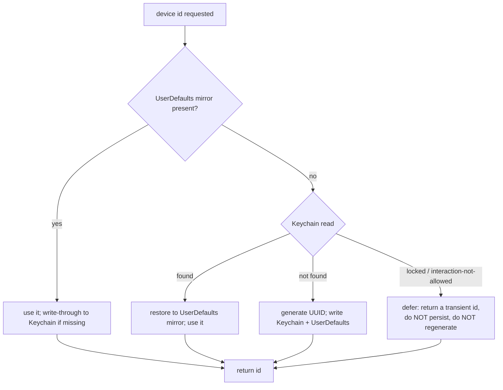

# fix: Keychain-backed stable device id to stop duplicate PostHog persons

## Summary

Make the anonymous device id survive app delete/reinstall by moving it from
`UserDefaults` into the Keychain (reusing the existing `KeychainStore`), behind
one shared accessor that the analytics `distinct_id` and the backend client both
read through. This stops the reinstall-driven person fragmentation in PostHog
while preserving today's behavior that the PostHog `distinct_id` and the backend
device id are the same value. Forward-only: it prevents new duplicates; it does
not merge the ~27 already-split historical persons.

Terminology used below: **device id** = the abstract identifier; `distinct_id` =
PostHog's REST field for it; `deviceId` = the Keychain account / Swift value. They
are one logical id stored in one place.

---

## Problem Frame

PostHog shows duplicate persons and inflated unique-user counts. Diagnosed and
data-confirmed via the PostHog MCP this session: for every Tailspot event,
persons equal distinct_ids 1:1 (`app_opened` = 27 persons / 27 distinct_ids for a
handful of testers), and the replay SDK is not the cause (of `app_opened`
persons, the ones with SDK events also have REST events; zero SDK-only).

Root cause: the device id is a UUID in `UserDefaults` under
`tailspot.account.deviceId` (`Analytics.swift` `distinctId(defaults:)`).
`UserDefaults` is wiped on app deletion and is per-simulator, so each reinstall
mints a new id → a new person; PostHog can't merge them (REST events carry no
`$anon_distinct_id`). The device *token* already lives in the Keychain
(`kSecAttrAccessibleAfterFirstUnlockThisDeviceOnly`) and survives reinstall, so
today a reinstall leaves a surviving token + a fresh id — a half-state that also
fails `ensureRegistered`'s "token AND id present" short-circuit and registers a
brand-new backend device. Moving the id into the Keychain alongside the token
fixes both at once.

A second, smaller dup source exists — the id changes mid-session on a fresh
install (Analytics plants a client UUID at launch, then `ensureRegistered`
overwrites it with the server id, so the first events attach to a throwaway
person). Its magnitude is unquantified and eliminating it carries real
trade-offs, so it is deferred (see Scope Boundaries) rather than fixed here.

---

## Requirements

Identity stability
- R1. The device id persists across app delete/reinstall on the same physical
  device, so one device maps to one PostHog person (and one backend device)
  going forward.
- R2. One shared accessor is the only source of the device id; the analytics
  `distinct_id` and the backend client both read/write through it.
- R4. The id stays unified across analytics and backend (the PostHog
  `distinct_id` equals the backend device id), as today — this plan changes the
  id's *storage and persistence*, not its value or precedence.
- R5. Existing installs keep their current id via a one-time migration of the
  `UserDefaults` value into the Keychain — no current user gets a fresh id.

Correctness and edge cases
- R3. A Keychain read that fails because protected data is locked must not be
  treated as "absent" and must not trigger generation of a new id. (Defensive:
  the app has no pre-first-unlock entry point today — see Risks — so this guards
  a path that isn't reachable yet; it is cheap insurance against a future
  background/extension entry.)
- R6. The PostHog SDK (replay + person-property `$set`) and the REST events
  resolve to the same `distinct_id`, since `identify(...)` reads the shared
  accessor.

Privacy
- R9. Before the build ships to TestFlight, the App Store privacy posture is
  reviewed for the now-uninstall-persistent device id (see Risks / Open
  Questions).

Test and verification
- R7. Migration and fallback logic is unit-tested through an injectable storage
  seam; the one real-Keychain round-trip is CI-probe-gated; the cross-layer
  shared-id contract test is updated.
- R8. Reinstall stability is verified on Noah's device (a real delete+reinstall
  keeps the same id) before merge, and against live PostHog after ship.

---

## Key Technical Decisions

- Reuse the existing `KeychainStore` (`TailspotAccountClient.swift`) with a new
  account `"deviceId"`, co-located with the existing `"deviceToken"`. No new
  Keychain wrapper. Co-locating the two identity halves means the
  `ensureRegistered` short-circuit can never again see a token-survives-but-id-
  reset half-state. `KeychainStore` already uses
  `kSecAttrAccessibleAfterFirstUnlockThisDeviceOnly` — device-bound (a restore to
  a new device starts fresh), the confirmed dedup-safe choice.
- One shared accessor (`nonisolated`, synchronous, non-throwing, returns
  `String`) that both `Analytics.distinctId` (MainActor) and the `nonisolated`
  `TailspotAccountClient` read through, and that `ensureRegistered` writes the id
  through. `nonisolated` so MainActor callers work; synchronous + non-throwing to
  preserve every existing `distinctId()` call site (including
  `PostHogSessionReplay.swift`). Mirror the `distinctId(defaults:)` injectable-
  seam shape so tests stay parallel-safe.
- Id precedence is unchanged from today: `ensureRegistered` still writes the
  server-minted deviceId to the shared id, so the PostHog `distinct_id` and the
  backend device id stay equal (R4). This plan only changes where that id is
  stored (Keychain, surviving reinstall) — it does not relax the id's value or
  make the client UUID canonical. (Making the client id canonical was
  considered and cut — see Scope Boundaries — because it splits existing vs. new
  testers into two id schemes and leaves no key to join a PostHog person to a
  backend device.)
- Resolve order: `UserDefaults` mirror first (fast, always-available) → Keychain
  (survives reinstall) → generate only when genuinely absent in both, writing
  through to both. The **mirror-present branch must also write-through to the
  Keychain** — that write-through is how an existing install (whose
  `UserDefaults` already holds the id, so the Keychain read never runs) gets
  migrated. A failed Keychain write is tolerated (the accessor is non-throwing;
  the mirror still serves the value and the next launch reconciles). Distinguish
  Keychain `errSecItemNotFound` (absent → may generate) from a locked error
  (`errSecInteractionNotAllowed` → defer, don't generate) per R3.

---

## High-Level Technical Design

Device-id resolution inside the shared accessor. The mirror-present write-through
(node USE) is the migration path for existing installs; the locked branch is the
R3 defensive guard:

Reinstall path: `UserDefaults` wiped → mirror absent → Keychain finds the
surviving id → restored. Normal launch: mirror present → no Keychain dependency.
Genuine first launch: both absent → generate once. `ensureRegistered`, on first
registration, writes the server id through this accessor so it lands in both the
Keychain and the mirror.

---

## Implementation Units

### U1. Shared Keychain-backed device-id accessor

- Goal: a single `nonisolated` accessor returning a stable device id, backed by
  the Keychain with a `UserDefaults` mirror, the write-through migration, and the
  locked-vs-absent guard, with an injectable storage seam for tests.
- Requirements: R1, R3, R5, R7
- Dependencies: none
- Files:
  - `ios/Tailspot/Tailspot/DeviceID.swift` — new `nonisolated enum DeviceID`
    with resolve/migrate/generate logic and an injectable seam (mirror
    `distinctId(defaults:)`). File-scope key constants carry `nonisolated`.
  - `ios/Tailspot/Tailspot/TailspotAccountClient.swift` — add a
    `deviceIdKeychainAccount = "deviceId"` sibling to `deviceTokenKeychainAccount`
    (reuse `KeychainStore`; no new wrapper).
  - `ios/Tailspot/TailspotTests/DeviceIDTests.swift` — new.
- Approach: resolve order per the KTD/HTD, writing through so the mirror and the
  Keychain converge — including on the mirror-present branch, which is the
  migration path for existing installs. Generation fires only on genuine absence
  in both. The Keychain read needs to surface `errSecItemNotFound` vs a locked
  error so generation only fires on true absence — `KeychainStore.load` currently
  collapses errors to `nil`, so add a status-returning read path for the id. Keep
  the public read synchronous, non-throwing, returning `String`; a failed
  Keychain write is swallowed (the mirror still serves the value). Tests use the
  injectable seam (a fake store) for all logic scenarios; a single real-Keychain
  round-trip is wrapped in the existing `keychainAvailable` probe so CI sim
  clones skip it rather than red-failing.
- Patterns to follow: `KeychainStore` (`TailspotAccountClient.swift`) for the
  Security calls and the probe-gated test; `Analytics.distinctId(defaults:)` for
  the injectable seam; `nonisolated` constant conventions in
  `TailspotAccountClient.swift`.
- Test scenarios:
  - Mirror present → returns it; write-through populates the Keychain if missing
    (this is the existing-install migration — R5).
  - Mirror absent, Keychain has the id (reinstall sim) → restores it to the
    mirror and returns the same value (R1).
  - Both absent → generates once, persists to both; a second call returns the
    same value.
  - Keychain read reports locked/interaction-not-allowed with mirror absent →
    does NOT generate/persist a new id (R3).
  - Keychain write fails on the write-through but the mirror succeeds → the
    accessor still returns the id (non-throwing tolerance).
  - Real-Keychain save→load→delete round-trip — CI-probe-gated.
- Verification: `DeviceIDTests` green locally; the fake-backed logic tests pass
  in CI; the probe-gated test skips cleanly on CI sim clones.

### U2. Route analytics + account through the accessor; migrate; update contract test

- Goal: `Analytics.distinctId`, `TailspotAccountClient.storedDeviceId`, and
  `ensureRegistered`'s id write all go through `DeviceID`, so the id is one value
  stored in the Keychain (surviving reinstall) and existing users migrate
  transparently.
- Requirements: R2, R4, R5, R6, R7
- Dependencies: U1
- Files:
  - `ios/Tailspot/Tailspot/Analytics.swift` — `distinctId(...)` delegates to
    `DeviceID` (keep the injectable parameter; preserve the synchronous,
    non-throwing signature).
  - `ios/Tailspot/Tailspot/TailspotAccountClient.swift` — `storedDeviceId` reads
    through `DeviceID`; `ensureRegistered` writes the server deviceId through
    `DeviceID` (Keychain + mirror) instead of writing only `UserDefaults`, so the
    canonical id persists across reinstall.
  - `ios/Tailspot/TailspotTests/AnalyticsTests.swift` — update the cross-layer
    contract test (`matchesTailspotAccountClientKey`) to assert the new shared
    canonical source rather than the raw `UserDefaults` key.
- Approach: `DeviceID` is the single source; `Analytics` and the account client
  become thin readers, and `ensureRegistered` routes its write through it. The
  SDK inherits the shared id via `identify(Analytics.distinctId())` (no change in
  `PostHogSessionReplay.swift`). Keeping the `ensureRegistered` write means the
  PostHog `distinct_id` stays equal to the backend device id (R4).
- Patterns to follow: the single-shared-id intent documented in `Analytics.swift`
  and asserted by the contract test.
- Test scenarios:
  - `Analytics.distinctId` and `storedDeviceId` return the same value for the
    same backing store (contract test, updated).
  - A pre-existing legacy id is returned unchanged after migration (R5).
  - After `ensureRegistered` writes the server id, a simulated reinstall (Keychain
    + token survive) short-circuits with no new device POST (R1).
  - With no PostHog key, `distinctId` still returns a stable value and capture
    stays a no-op (existing behavior preserved).
- Verification: full `TailspotTests` suite green; the contract test asserts the
  shared source; no `distinctId()` call site changed shape.

---

## Risks & Dependencies

- Privacy posture (pre-ship gate, R9): persisting an anonymous device id across
  app deletion is the trait Apple associates with the "Device ID" data type and
  Tracking (App Store privacy label / ATT). `Analytics.swift` documents the
  current posture as "frozen, privacy-first, nothing ATT-triggering." Before the
  build reaches TestFlight, confirm whether the privacy nutrition label or ATT
  stance needs updating. This is a declaration/legal check (it's an anonymous id,
  not PII), and it ties into the deferred privacy-policy read in PLAN.md.
- Keychain-survives-deletion is the load-bearing assumption and is OS/version-
  dependent. Promote it to a hard gate: a real delete+reinstall on Noah's iPhone
  (iOS 26.x) must keep the same `distinct_id` BEFORE merge to main — not after
  ship, when testers have already churned. If it does not survive, the fix is a
  no-op for R1; the fallback is an App Group container or
  `NSUbiquitousKeyValueStore`. The simulator cannot prove this.
- Verify against live PostHog (MCP, project 466448) after ship: unique-person
  count stops climbing on reinstall, and SDK replay + REST events resolve to one
  person (R8).
- Forward-only: this does not merge the ~27 existing duplicate persons (no
  reliable join key) or already-split backend devices (catch idempotency is
  per-device). Historical numbers stay inflated; clean data starts after ship.
- CI: any test touching the real Keychain must use the existing `keychainAvailable`
  probe + `withKnownIssue` pattern, or CI sim clones red-fail for a non-bug.
- Pure iOS-storage change — no `backend/src/db/schema.ts` touch, so the manual-
  migration-drift guardrail does not apply here.

---

## Open Questions

- Privacy/ATT (R9): does an uninstall-persistent anonymous device id change
  Tailspot's App Store privacy label (Device ID / Tracking) or require ATT? Needs
  Noah's privacy/legal read before shipping. If it does, the device-bound
  `ThisDeviceOnly` choice and the anonymity (no PII, no cross-app linkage) are
  the mitigations to weigh.

---

## Scope Boundaries

- In scope: a Keychain-backed stable device id behind one shared accessor; the
  one-time UserDefaults→Keychain migration (via the mirror-present write-through);
  routing analytics + account reads and the `ensureRegistered` write through it;
  tests; on-device + live-PostHog verification; the pre-ship privacy check.
- Out of scope:
  - Merging the existing duplicate persons / split backend devices — forward-only
    fix, no reliable join key.

  ### Deferred to Follow-Up Work
  - Eliminating the first-session client→server id swap (the secondary dup
    source). First quantify its magnitude in PostHog (how many of the historical
    persons are first-session transients vs. reinstall splits); only fix if
    material. The fix (make the client id canonical, stop the `ensureRegistered`
    overwrite) is deferred because it splits existing testers (already server-id-
    canonical) from new installs and removes the PostHog↔backend id equality with
    no join key to replace it — it would also need the registration short-circuit
    re-gated on the token rather than the id, plus a deliberate join key (e.g.
    send the client id to the backend at registration, or `$set` the backend
    device id as a PostHog person-property).
  - The handle person-property backfill — the claim event already shipped (#54);
    a launch-time `$set` is separate, secondary.
  - Migrating product events off the REST pipeline onto the SDK.
  - A device handed to a new person who deletes + reinstalls *without* a factory
    reset will inherit the prior owner's identity (handle, catches). Accepted for
    a free, anonymous, no-PII game; `ThisDeviceOnly` already prevents cross-device
    iCloud restore, and a factory reset clears the Keychain. Noted so it isn't a
    surprise; no code change.
