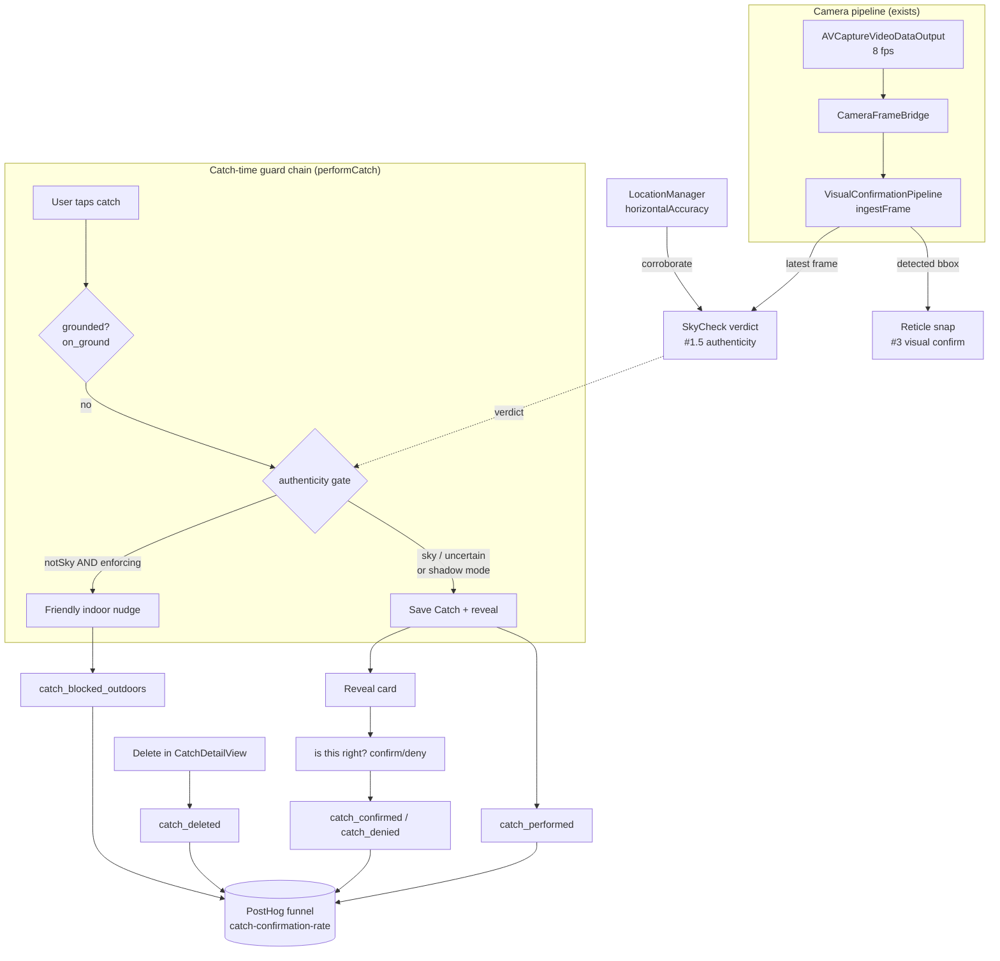

# feat: Bet A — make the catch real

## Summary

This plan executes **Bet A (the Real-catch engine)** — the foundation that the rest of Tailspot rests on: a catch should only count when it's a real plane the user genuinely saw, outdoors. Research found the track is much further along than the backlog implied, so the plan is weighted accordingly:

- **Item #1 — Passive catch-confirmation telemetry (the real build).** Genuinely greenfield: no `catch_performed`, `catch_deleted`, or confirm/deny event exists today, so the north-star metric (catch-confirmation-rate) is uncomputable. Add catch-lifecycle events, a light "is this right?" affordance, and a persisted confirmation flag — turning the north-star into a real PostHog funnel and giving the authenticity gate a measurement safety net.
- **Item #1.5 — v1 outdoor/sky authenticity gate (new, Noah's call).** Solve the headline problem: people catching planes indoors. A camera **sky-check** (structure/color, night-aware) corroborated by GPS accuracy, shipped **shadow-mode first** then flipped to enforcement once validated. Blocks the ceiling/wall cheat without breaking night / far / behind-cloud catches.
- **Item #3 — Visual confirmation go-live.** Already a complete, live-in-DEBUG direct-CoreML pipeline; "go-live" = a user-facing toggle, a passing field-gate validation, and committed model licensing — not a build.
- **Item #2 — Replay/log loop.** Essentially shipped (the regression bench landed end-to-end). Documented as done; `os_log` capture stays session-scoped by design.

The shared spine: items #1.5 and #3 both ride the existing camera-frame pipeline, and #1.5's safety net is #1's telemetry — so the three live builds reinforce each other.

---

## Problem Frame

Tailspot's core promise (STRATEGY.md): *"Every catch is a plane you actually saw — overhead, outdoors."* Today the catch is purely geometric — ADS-B position + GPS + compass + tilt decide where a plane's label is drawn; the camera never gates anything. That produces two strategy gaps:

1. **We can't see if catches are real.** The north-star, catch-confirmation-rate ("share of capture attempts that produce an ID the user keeps and trusts"), has no negative signal instrumented: `catch_uploaded` and `empty_sky_tap` exist, but nothing records deletes, mis-IDs, or confirmations. We're flying blind on the one metric the whole strategy hinges on.
2. **The authenticity promise isn't enforced.** Nothing stops an indoor "catch through the ceiling." Per the case analysis (this session): a naïve "camera must see the plane" gate would correctly kill indoor cheats but wrongly kill legitimate night / far / behind-cloud catches — because "camera sees no plane" is ambiguous. The honest discriminator is *"is the phone pointed at open sky?"*, judged on structure/color (not brightness, so night sky passes).

This plan closes both: measure first (#1), then enforce the indoor bar carefully (#1.5), while finishing the accuracy lever already built (#3).

---

## Requirements

| ID | Requirement | Source |
|----|-------------|--------|
| R1 | Every successful catch fires `catch_performed`; every delete fires `catch_deleted` — with properties (icao24, rarity, aircraftType, isDuplicate, count) sufficient to compute catch-confirmation-rate as a PostHog funnel. | STRATEGY north-star |
| R2 | At the reveal moment the user can signal "is this right?"; a deny fires `catch_denied` + a confirm fires `catch_confirmed`, and the verdict persists as an additive optional flag on `Catch`. | This session (call-out 2) |
| R3 | `PrivacyInfo.xcprivacy` is finalized (DRAFT removed) and declares all collected data (product interaction, anonymous device id) before the next TestFlight; the App Store Connect nutrition-label sync is flagged as Noah's manual step. | Learnings (privacy gate) |
| R4 | A v1 authenticity gate decides "pointed at open sky?" from the camera frame (structure/edge-density + color-temperature, **night-aware**) corroborated by GPS horizontal accuracy. It blocks **only** on high-confidence not-sky and **fails open** on uncertainty. | This session (Noah) |
| R5 | The gate ships **shadow-mode first** — it computes and logs its verdict (`outdoor_gate_shadow`) but never blocks — and is validated offline against labeled indoor/outdoor sessions before enforcement is enabled behind a flag. | This session (design choice 3) |
| R6 | When enforcing and the verdict is not-sky, the catch is refused with a friendly "head outside and point at the sky" message, and `catch_blocked_outdoors` fires. | This session |
| R7 | Visual confirmation is enable-able in Release via a user-facing Settings toggle (default off), and is enabled by default only after the field gate passes (≥2× median screen-error reduction on confirmed-visible aircraft). | tools/visual-confirmation/SWIFT-DESIGN.md gate |
| R8 | The bundled YOLOX detector ships with committed license/attribution (Apache-2.0) and a provenance note, suitable for App Store distribution. | Pre-distribution legal |
| R9 | The catch-engine regression bench (item #2) is documented as shipped in PLAN §9; `os_log` capture remains session-scoped (no always-on log file is built). | Research (shipped) |

Origin requirements R1–R12 (the offline bench) are **satisfied by shipped code** (see Scope → Already shipped); this plan carries them as done rather than re-implementing.

---

## Key Technical Decisions

- **KTD1 — Telemetry on the REST path, not the SDK.** New catch events use `Analytics.capture(_:_:)` (the SDK-free REST pipeline), preserving the no-op-without-key behavior. The PostHog SDK is reserved for session replay + person-property `$set`; do not route catch events through it, and keep any SDK/REST names distinct to avoid double-counting. (Learnings #1.)
- **KTD2 — Persist confirmation as an additive optional field.** `Catch` gains `confirmed: Bool?` (nil = unanswered). SwiftData migrations stay lightweight/additive — testers' on-device Hangars are unrecoverable, so no breaking schema change. `confirmed` is moment-data and is never backfilled. (CLAUDE.md; Learnings #8.)
- **KTD3 — The authenticity signal is "open sky," not "this plane."** The gate asks whether the frame is open sky (low edge-density, smooth, sky-like color temperature), **not** whether the YOLOX detector found a plane. This is what keeps night / far / behind-cloud catches working while still blocking ceilings/walls. Brightness is explicitly *not* a discriminator (night sky is dark-but-smooth; a dim room is dark-but-cluttered).
- **KTD4 — Fail open; block only on confidence.** Verdict is `.sky | .notSky | .uncertain`; only `.notSky` blocks (when enforcing). Ambiguity always allows the catch. Better to miss a few cheats than strand a real outdoor catch. GPS accuracy corroborates the camera (camera leads).
- **KTD5 — Shadow-mode → validate → enforce.** The gate ships logging-only behind an enforcement flag (default off). Enforcement is enabled only after offline validation on labeled indoor *and* outdoor sessions confirms it blocks ceilings and not legit catches — the same go/no-go discipline the visual-confirmation field gate already uses.
- **KTD6 — Heuristic gate for v1, learned classifier deferred.** v1 uses a transparent, tunable image heuristic (downscaled edge-density + color stats) so it can be tuned against the offline corpus immediately. A Create ML indoor/outdoor classifier is a deferred upgrade, not v1.
- **KTD7 — Visual confirmation stays positioning-only; go-live is a gate flip.** Do not rebuild the pipeline (it exists, direct-CoreML by deliberate design — not Vision/VNCoreMLRequest). Go-live = expose a Settings toggle, run the field gate, and flip the Release default on a pass. Snapping the *saved catch photo* bracket to the detected bbox is deferred (today it stays geometric).
- **KTD8 — Reuse the camera-frame bridge.** The gate consumes frames from the existing `CameraFrameBridge` → `VisualConfirmationPipeline.ingestFrame` path (8 fps, BGRA, portrait-rotated); it does not add a second `AVCaptureVideoDataOutput`.

---

## High-Level Technical Design

The three live builds share one camera/telemetry spine and converge at the **catch-time guard chain** in `performCatch`:

The grounded-plane block (backlog #11) is shown as the first guard for context; it is **not** in this plan's scope but shares the same insertion point, so the authenticity gate is built to compose with it.

---

## Scope Boundaries

### In scope
- Catch-lifecycle + confirm/deny telemetry and the persisted `confirmed` flag (#1).
- The v1 outdoor/sky authenticity gate: analyzer, shadow-mode wiring, offline validation tooling, enforcement + indoor UX (#1.5).
- Visual-confirmation go-live: Settings toggle, field-gate validation run, model licensing (#3).
- Doc closure of #2 + the relevant PLAN §9 / CHANGELOG updates.
- `PrivacyInfo.xcprivacy` finalization.

### Already shipped (carried as done, verified by research — do not rebuild)
- The offline regression bench: 8-mode failure scoring (`FailureMode.swift`), Claude-readable diagnosis, one-tap recording (`recordingRow`), per-session log capture (`LogCapture.swift`, via `OSLogStore` at stop), local corpus with graceful CI skip (`FailureModeRegressionTests.swift`), redaction (`ReplayRedaction.swift`). Satisfies origin R1–R12.
- The visual-confirmation pipeline itself: `AirplaneDetector`, `AirplaneDetectionDecoder`, `VisualConfirmationPipeline`, `VisualFixTracker`, bundled `YoloxAirplane_int8.mlpackage`, the bbox→reticle override (`ContentView.swift:335-337`), and the field-gate scorer (`tools/visual-confirmation/score_field_session.py`).

### Deferred to Follow-Up Work
- Snapping the **saved catch-photo** bracket to the detected bbox (today geometric; `performCatch` uses `onScreenPositions`).
- A learned (Create ML) indoor/outdoor classifier to replace the v1 heuristic.
- An always-on `Documents/tailspot.log` (would duplicate the session-scoped `LogCapture`).
- The "tried it indoors" easter-egg badge (pairs with the grounded-plane badge, #11).
- The grounded-plane catch block itself (backlog #11) — separate item; this plan only makes the guard chain compose with it.

### Outside this plan's reach
- Mis-identification ground-truthing (origin mode 6) — a naming-pipeline concern.
- Changing the geometric engine's accuracy math (`Geo.screenPosition`) — measured, not modified here.

---

## Implementation Units

### Phase A — Measurement foundation (#1)

### U1. Catch-lifecycle events (`catch_performed` + `catch_deleted`)

- **Goal:** Instrument the two ends of the catch lifecycle so the north-star funnel has its numerator and a negative signal.
- **Requirements:** R1.
- **Dependencies:** none.
- **Files:**
  - `ios/Tailspot/Tailspot/ContentView.swift` (fire `catch_performed` in `performCatch` after `modelContext.save()`, ~line 988; one event per catch row, include `isDuplicate` for dedup hits)
  - `ios/Tailspot/Tailspot/CatchDetailView.swift` (fire `catch_deleted` inside `performDelete()`, lines 332–341, before/within the delete loop so `row.count`/`row.icao24`/`row.rarity` are in scope)
  - `ios/Tailspot/TailspotTests/CatchTelemetryTests.swift` (new)
- **Approach:** Use `Analytics.capture("catch_performed", [...])` / `Analytics.capture("catch_deleted", [...])` on the REST path (KTD1). Properties as `AnalyticsValue` cases: `icao24:.string`, `rarity:.string`, `aircraftType:.string`, `isDuplicate:.bool`, `slantKm:.double`; for delete add `count:.int` (single vs "all N"). Fire-and-forget; never block the save/delete.
- **Patterns to follow:** existing `tap_reveal`/`empty_sky_tap` calls in `ContentView.swift`; the `catch_uploaded` call in `CatchUploader.swift`.
- **Test scenarios** (inject `FakeTransport` via `Analytics._testQueue`, per `AnalyticsTests.swift`):
  - Happy: a new catch fires exactly one `catch_performed` with the expected icao24/rarity/type and `isDuplicate=false`.
  - Edge: a duplicate (already-caught) catch fires `catch_performed` with `isDuplicate=true` and no DB row is created (assert via in-memory container).
  - Happy: deleting a single-row catch fires one `catch_deleted` with `count=1`.
  - Edge: deleting a grouped `HangarRow` of N icao rows fires `catch_deleted` with `count=N` (decide and assert: one aggregate event vs one per row — default one aggregate event).
  - Error: with no PostHog key (`_testQueue` nil), `performCatch`/`performDelete` still succeed and no crash occurs.
- **Verification:** Events appear in the PostHog activity feed from a dev build (verify via PostHog MCP before concluding anything is wired wrong — Learnings #1); a funnel `catch_performed → (not catch_deleted within window)` is constructible.

### U2. "Is this right?" affordance + persisted `confirmed` flag

- **Goal:** Let the user confirm/deny the ID at the reveal moment, persist it, and fire the confirm/deny events that complete the catch-confirmation signal.
- **Requirements:** R2.
- **Dependencies:** U1 (shared event conventions).
- **Files:**
  - `ios/Tailspot/Tailspot/Catch.swift` (add `var confirmed: Bool?` — additive optional, KTD2; not set in the classifier init, not backfilled)
  - `ios/Tailspot/Tailspot/CardReveal.swift` (add a low-friction "Right plane?" confirm/deny control; default unanswered)
  - `ios/Tailspot/Tailspot/MultiCatchReveal.swift` (same affordance per revealed card, or a single batch confirm — see Open Questions)
  - `ios/Tailspot/Tailspot/ContentView.swift` (thread the verdict back to set `confirmed` on the right `Catch` row; reuse the `pendingReveal`/`pendingMultiReveal` dismiss callbacks ~lines 614–637)
  - `ios/Tailspot/TailspotTests/CatchConfirmationTests.swift` (new)
- **Approach:** A subtle affordance (e.g., a "Not the right plane?" link + a confirm tap), **not** a blocking modal at the magic moment. On confirm → `confirmed = true`, fire `catch_confirmed`; on deny → `confirmed = false`, fire `catch_denied` (with icao24/rarity). Leaving the reveal without answering leaves `confirmed = nil` (no event). Persist via the existing `modelContext`.
- **Patterns to follow:** `CardReveal` button/dismiss structure; `CatchDetailView` backfill discipline (write moment-data once, don't overwrite).
- **Test scenarios:**
  - Happy: tapping confirm sets `confirmed=true` on the catch and fires one `catch_confirmed`.
  - Happy: tapping deny sets `confirmed=false` and fires one `catch_denied`.
  - Edge: dismissing without answering leaves `confirmed=nil` and fires neither event.
  - Edge (multi-catch): per-card verdicts map to the correct `Catch` rows (assert each row's `confirmed`).
  - Migration: an existing catch created before this field loads with `confirmed=nil` (in-memory container round-trip).
- **Verification:** Confirm/deny round-trips persist across app relaunch (dev build); events visible in PostHog.

### U3. Finalize the privacy manifest

- **Goal:** Clear the TestFlight privacy gate for the new analytics.
- **Requirements:** R3.
- **Dependencies:** none (can land independently).
- **Files:** `ios/Tailspot/Tailspot/PrivacyInfo.xcprivacy` (remove the DRAFT caveat; confirm `NSPrivacyCollectedDataTypeProductInteraction` + `DeviceID` cover the new events — they already do; no new required-reason API is added).
- **Approach:** Verification + un-DRAFT, not new declarations (the manifest already lists product-interaction analytics and the anonymous device id). Add an inline note that the App Store Connect nutrition label is a separate surface.
- **Execution note:** The App Store Connect nutrition-label sync is a **manual Xcode/ASC step only Noah can do** — flag it explicitly at hand-off; do not mark R3 fully done until Noah confirms.
- **Test expectation:** none — manifest/metadata change, no behavioral code.
- **Verification:** Manifest parses; Noah confirms the ASC label matches before the next build.

### Phase B — v1 outdoor/sky authenticity gate (#1.5)

### U4. `SkyCheck` analyzer

- **Goal:** A pure, testable component that decides `.sky | .notSky | .uncertain` from a camera frame (+ optional GPS accuracy), night-aware and fail-open.
- **Requirements:** R4.
- **Dependencies:** none (pure compute).
- **Files:**
  - `ios/Tailspot/Tailspot/SkyCheck.swift` (new — `nonisolated struct SkyCheck` + `enum SkyVerdict`)
  - `ios/Tailspot/TailspotTests/SkyCheckTests.swift` (new)
  - `ios/Tailspot/TailspotTests/SkyCheckFixtures/` (new, committed tiny test images — daytime sky, night sky, ceiling, wall, contrail/far; small enough to commit)
- **Approach (directional, not spec):** downscale the frame to a small grayscale/という thumbnail; compute (a) **edge/texture density** (gradient magnitude — open sky is low, interiors high), (b) **brightness uniformity** (tile-variance — sky smooth, rooms cluttered), (c) **color-temperature / white-balance stats** (skylight vs warm artificial light). Combine into a score with conservative thresholds → verdict; GPS `horizontalAccuracy` shifts confidence (poor accuracy nudges toward `.notSky`, never sole cause). **Brightness alone never decides** (KTD3). Keep all tuning constants in one documented block (mirror the `ADSBManager` visibility-constants pattern) so they can be retuned against the offline corpus without code spelunking.
- **Patterns to follow:** `VisualFixTracker.swift` / `FailureModeThresholds` as the model for a `nonisolated`, unit-tested, constants-documented analyzer; `AspectFillTransform` for any image-space math.
- **Test scenarios:**
  - Happy: daytime-sky fixture → `.sky`.
  - Happy (the night guardrail): night-sky fixture (dark, smooth) → `.sky`, **not** `.notSky` — this is the key regression to lock.
  - Happy: ceiling fixture and wall fixture → `.notSky`.
  - Edge: far-plane/contrail fixture (mostly sky, tiny speck) → `.sky` or `.uncertain`, never `.notSky`.
  - Edge: building-fills-frame fixture → `.notSky` or `.uncertain` (acceptable; borderline by design).
  - Edge: GPS corroboration — same near-threshold frame flips toward `.notSky` only when accuracy is poor; with sharp GPS stays `.sky`/`.uncertain`.
  - Determinism: same input → same verdict.
- **Verification:** Every fixture classifies as asserted; the night-sky and contrail cases never return `.notSky`.

### U5. Wire `SkyCheck` into the pipeline + `performCatch` (shadow mode)

- **Goal:** Run the gate on real catches but **log only** — never block — and capture frames for offline validation.
- **Requirements:** R5.
- **Dependencies:** U4; U1 (event conventions).
- **Files:**
  - `ios/Tailspot/Tailspot/VisualConfirmationPipeline.swift` (expose the latest ingested frame / run `SkyCheck` on the same `ingestFrame` path; publish the current `SkyVerdict`)
  - `ios/Tailspot/Tailspot/ContentView.swift` (in `performCatch`, read the current verdict + GPS accuracy, fire `outdoor_gate_shadow` with the verdict and signals; **do not** alter control flow)
  - `ios/Tailspot/Tailspot/CropFrameSaver.swift` or sibling (save the catch-moment frame + verdict to the existing `Documents/replays/frames/` sidecar for offline re-scoring; additive-optional fields)
  - `ios/Tailspot/TailspotTests/SkyCheckShadowTests.swift` (new)
- **Approach:** Reuse `CameraFrameBridge` (KTD8) — no new capture output. Verdict computation runs `nonisolated` on the detection/capture queue and publishes back to `@MainActor` (Learnings #6: hop to main for `@Published`; mark extensions `nonisolated`). `performCatch` stays behaviorally identical; it only emits telemetry. Gate behind an `enforce` flag (default false).
- **Patterns to follow:** the existing `visualConfirm.ingestFrame` wiring (`ContentView.swift:669`); `CropFrameSaver` sidecar writing (`VisualConfirmationPipeline.swift:245`).
- **Test scenarios:**
  - Happy: a catch in shadow mode always succeeds regardless of verdict; `outdoor_gate_shadow` fires once with the computed verdict.
  - Edge: `.notSky` in shadow mode still saves the catch (assert DB row created) and fires the shadow event (not a block event).
  - Concurrency: verdict produced off-main is consumed without a main-thread assertion failure (smoke).
- **Verification:** A dev session indoors logs `.notSky` shadow events while still catching; frames land in the sidecar for re-scoring.

### U6. Offline gate-validation tool + field protocol

- **Goal:** A repeatable way to score the gate's decisions against labeled indoor/outdoor sessions — the go/no-go for enabling enforcement.
- **Requirements:** R5.
- **Dependencies:** U5 (produces the labeled frames/verdicts).
- **Files:**
  - `tools/authenticity-gate/score_gate_session.py` (new — read the frames sidecar, compute block/allow vs label, report false-block and missed-cheat rates)
  - `tools/authenticity-gate/FIELD-TEST.md` (new — the indoor + outdoor + night capture protocol)
  - optionally `ios/Tailspot/TailspotTests/SkyCheckCorpusTests.swift` (new — replay committed *redacted* fixtures through `SkyCheck`, skipping gracefully when local-only fixtures are absent)
- **Approach:** Mirror `tools/visual-confirmation/score_field_session.py` + `FIELD-TEST.md`. Go/no-go bar: **zero false blocks on confirmed-outdoor sessions (incl. night + far)** and a meaningful block rate on indoor sessions. Local full-fidelity captures stay gitignored (Learnings: targeted `!`-exception, not blanket ignore); any committed fixtures are redacted.
- **Patterns to follow:** `tools/visual-confirmation/` layout; `FailureModeRegressionTests` graceful-skip trait for any committed corpus test.
- **Test scenarios:** (for the optional Swift corpus test) committed redacted fixtures classify as labeled; suite skips when local fixtures absent so public CI stays green.
- **Verification:** Running the scorer on a mixed corpus prints per-session verdicts and the false-block / cheat-catch rates; Noah signs off on the bar before U7 enables enforcement.

### U7. Enforcement + indoor UX

- **Goal:** Flip the gate from shadow to enforcing (flag-gated), refusing indoor catches with a friendly nudge.
- **Requirements:** R6.
- **Dependencies:** U6 (validation must pass first).
- **Files:**
  - `ios/Tailspot/Tailspot/ContentView.swift` (in `performCatch`: when `enforce && verdict == .notSky`, skip the save, present the nudge, fire `catch_blocked_outdoors`; `.sky`/`.uncertain` proceed — KTD4)
  - `ios/Tailspot/Tailspot/SettingsScreen.swift` (optional debug/QA toggle for the enforcement flag during rollout)
  - a small SwiftUI nudge view (reuse the empty-sky status-pill style) — *"Looks like you're indoors — head outside and point at the sky to catch a plane! ✈️"*
  - `ios/Tailspot/TailspotTests/SkyCheckEnforcementTests.swift` (new)
- **Approach:** Single new branch in the catch path; everything else unchanged. Enforcement flag default **off** at merge; turned on only after U6 sign-off (and ideally one TestFlight build in shadow). Compose cleanly with the (future) grounded-plane guard — order: grounded → authenticity → save.
- **Test scenarios:**
  - Happy: `enforce=true`, verdict `.notSky` → no `Catch` row created, nudge shown, one `catch_blocked_outdoors` fires.
  - The night guardrail: `enforce=true`, verdict `.sky` on a dark frame → catch succeeds (no block).
  - Fail-open: `enforce=true`, verdict `.uncertain` → catch succeeds.
  - Off by default: `enforce=false` → `.notSky` still catches (parity with shadow).
  - Multi-catch: a blocked attempt creates zero rows (no partial multi-catch).
- **Verification:** On-device, an indoor ceiling attempt is refused with the nudge; an outdoor (incl. dusk/night) attempt catches normally.

### Phase C — Visual confirmation go-live (#3)

### U8. User-facing visual-confirmation toggle

- **Goal:** Make visual confirmation enable-able in Release (not just the DEBUG wrench), default off.
- **Requirements:** R7.
- **Dependencies:** none.
- **Files:**
  - `ios/Tailspot/Tailspot/SettingsScreen.swift` (a "Snap reticle to plane (beta)" toggle bound to the existing `tailspot.debug.visualConfirm` UserDefaults key, or a new release key)
  - `ios/Tailspot/Tailspot/VisualConfirmationPipeline.swift` (read the release key; keep the DEBUG default = on, Release default = off until U9)
- **Approach:** Promote the existing UserDefaults switch to a real Settings row; do not change pipeline internals (KTD7).
- **Patterns to follow:** existing `@AppStorage` toggles in `SettingsScreen.swift`; the current `visualConfirmRow` debug control.
- **Test scenarios:** toggling the Settings control flips the published `enabled`/`isAvailable` state; default is off in a simulated Release config.
- **Verification:** A TestFlight (Release) build can turn visual confirmation on/off from Settings.

### U9. Field-gate validation run + enable-by-default decision

- **Goal:** Decide go-live on the existing ≥2× median-error bar.
- **Requirements:** R7.
- **Dependencies:** U8.
- **Files:** `tools/visual-confirmation/score_field_session.py`, `tools/visual-confirmation/FIELD-TEST.md` (run, not edit); `ios/Tailspot/Tailspot/VisualConfirmationPipeline.swift` (flip Release default on a pass); `PLAN.md` (record the result).
- **Execution note:** **Noah-in-the-loop, on-device** — the Simulator can't supply camera/GPS/compass. One SFO/OAK-corridor session with recording on; score bracket-to-plane error with vs without the visual fix across tap-pinned aircraft. PASS = ≥2× median reduction on confirmed-visible aircraft.
- **Test expectation:** none — validation/decision unit, not code (the flip itself is a one-line default change covered by U8's tests).
- **Verification:** Scorer reports the median-error reduction; on a pass, Release default flips and the result is recorded in PLAN §9.

### U10. YOLOX model license + attribution

- **Goal:** Make the bundled detector distribution-safe.
- **Requirements:** R8.
- **Dependencies:** none.
- **Files:** `ios/Tailspot/Tailspot/YoloxAirplane_int8.mlpackage/` (add/confirm a committed `LICENSE`/attribution); `tools/visual-confirmation/REPORT.md` or an About-screen note (record YOLOX = Apache-2.0 + the airplane fine-tune's training-data provenance).
- **Approach:** Document, don't relicense. YOLOX is Apache-2.0 (permissive — the Ultralytics AGPL concern does **not** apply); confirm the fine-tune data is clean for distribution.
- **Test expectation:** none — licensing/docs.
- **Verification:** License/attribution committed; provenance noted for the App Store privacy/About surface.

### Phase D — Close-out (#2 + docs)

### U11. Document #2 as shipped + update PLAN/CHANGELOG

- **Goal:** Close item #2 honestly and reflect the reframed Bet A in the canonical docs.
- **Requirements:** R9.
- **Dependencies:** none (do last to capture what landed).
- **Files:** `PLAN.md` (§9 — mark #2 shipped: bench U1–U6 + the decision that `os_log` capture is session-scoped, no always-on file; reflect the new #1.5 gate), `CHANGELOG.md` (round entry).
- **Approach:** Fold doc updates into the work (not optional — Learnings: "always update docs"). Records the os_log decision so it isn't re-litigated.
- **Test expectation:** none — docs.
- **Verification:** PLAN §9 reflects shipped/remaining accurately; the doc-staleness Stop hook is satisfied.

---

## Risks & Dependencies

- **False blocks on real catches (highest risk).** A miscalibrated gate that rejects night/far catches would damage the core hobby. Mitigation: KTD4 fail-open + KTD5 shadow-mode-then-validate + the night-sky regression test (U4) + `outdoor_gate_shadow`/`catch_blocked_outdoors` telemetry to watch the false-block rate. Enforcement stays off until U6 passes.
- **GPS indoors is noisy, not binary.** Near a window or in a car, GPS can look outdoor-ish. Mitigation: camera leads, GPS only corroborates (KTD4).
- **Privacy gate (R3) blocks TestFlight.** Any build with the new events needs the finalized manifest + ASC label. Mitigation: U3 lands early; flag Noah's manual ASC step.
- **Reveal-moment friction (U2).** A heavy confirm prompt would sour the magic moment. Mitigation: subtle affordance, unanswered is fine, no modal.
- **Field gate needs the device + corridor (U9).** Mitigation: bundle the run with a normal field-test session; it's a decision unit, not a blocker for Phases A/B code.
- **Dependencies:** SwiftData additive migration only (KTD2); no new SPM deps (Vision/CoreML/CoreImage are first-party — if any dep is added, commit `Package.resolved`, Learnings #7); one worktree per phase (Learnings #9); device required for U7/U9 verification.

---

## Open Questions (deferred to implementation)

- Multi-catch confirm/deny (U2): per-card verdicts vs a single batch confirm — decide when building `MultiCatchReveal`.
- `catch_deleted` granularity (U1): one aggregate event per delete action vs one per icao row — default aggregate; revisit if funnel analysis needs per-row.
- `SkyCheck` thresholds (U4): exact edge-density / color-temp cutoffs — tune against the offline corpus (U6), not guessable up front.
- Whether the enforcement flag is a remote/config flag vs a build-time default — start build-time; revisit if a remote kill-switch is wanted.

---

## Acceptance Examples

- **AE1** (R1). Given a successful new catch, when saved, then exactly one `catch_performed` fires with icao24/rarity/aircraftType and `isDuplicate=false`.
- **AE2** (R1). Given a user deletes a grouped catch of N rows, when confirmed, then `catch_deleted` fires with `count=N`.
- **AE3** (R2). Given the reveal screen, when the user taps deny, then `catch_denied` fires and the catch's `confirmed` is `false`; tapping confirm sets `true` and fires `catch_confirmed`; dismissing leaves `nil` and fires neither.
- **AE4** (R4, R6). Given the phone indoors at a ceiling (clearly not sky) with the gate enforcing, when the user taps catch, then no `Catch` row is created, the indoor nudge shows, and `catch_blocked_outdoors` fires.
- **AE5** (R4). Given a real outdoor **night** catch (dark but smooth sky) with the gate enforcing, when evaluated, then the verdict is not `.notSky` and the catch succeeds.
- **AE6** (R5). Given shadow mode, when the verdict would block, then `outdoor_gate_shadow` fires and the catch still succeeds.
- **AE7** (R5, carries origin AE1). Given a fresh CI clone with no local fixtures, when tests run, then the gate corpus tests skip (not fail) and the suite stays green.
- **AE8** (R7). Given a Release build, when the field gate passes, then visual confirmation can be enabled by default and toggled in Settings.

---

## Sources & Research

- **Origin:** `docs/brainstorms/2026-06-18-catch-engine-feedback-loop-requirements.md` (offline bench; satisfied by shipped code — R1–R12).
- **Strategy:** `STRATEGY.md` — Bet A, catch-confirmation-rate north-star, tester-active/user-passive split, "a plane you actually saw, outdoors."
- **Codebase grounding (this session):** `Analytics.swift` (REST `capture` API, `AnalyticsValue`, no-op-without-key), `Catch.swift` (flat `@Model`, additive-optional fields), `ContentView.swift` (`performCatch` ~873, reveal ~614–637), `CatchDetailView.swift` (`performDelete` 332–341), `VisualConfirmationPipeline.swift` + `AirplaneDetector.swift` + `VisualFixTracker.swift` + `YoloxAirplane_int8.mlpackage` (built pipeline, gated `tailspot.debug.visualConfirm`), `CameraPreview.swift` (`CameraFrameBridge`, 8 fps), `FailureMode.swift`/`LogCapture.swift`/`FailureModeRegressionTests.swift` (#2 shipped), `tools/visual-confirmation/{SWIFT-DESIGN.md,score_field_session.py,FIELD-TEST.md}` (field gate), `PrivacyInfo.xcprivacy` (DRAFT).
- **Learnings (project auto-memory):** REST-vs-SDK analytics split + verify-with-PostHog-MCP; privacy-manifest update owed; MainActor/capture-queue isolation; additive-only SwiftData migrations; targeted `.gitignore` `!`-exceptions; worktree-per-feature; commit `Package.resolved` with any SPM dep; always update docs.
- **External (Vision/Core ML, iOS 26):** largely confirmatory — the repo deliberately uses direct CoreML (not Vision/VNCoreMLRequest) for letterbox control; the Ultralytics-AGPL licensing flag does **not** apply (bundled model is YOLOX / Apache-2.0). Architecture choices (off-main async detection, ~8 fps throttle, portrait orientation, buffer-retention discipline) match the existing pipeline.
