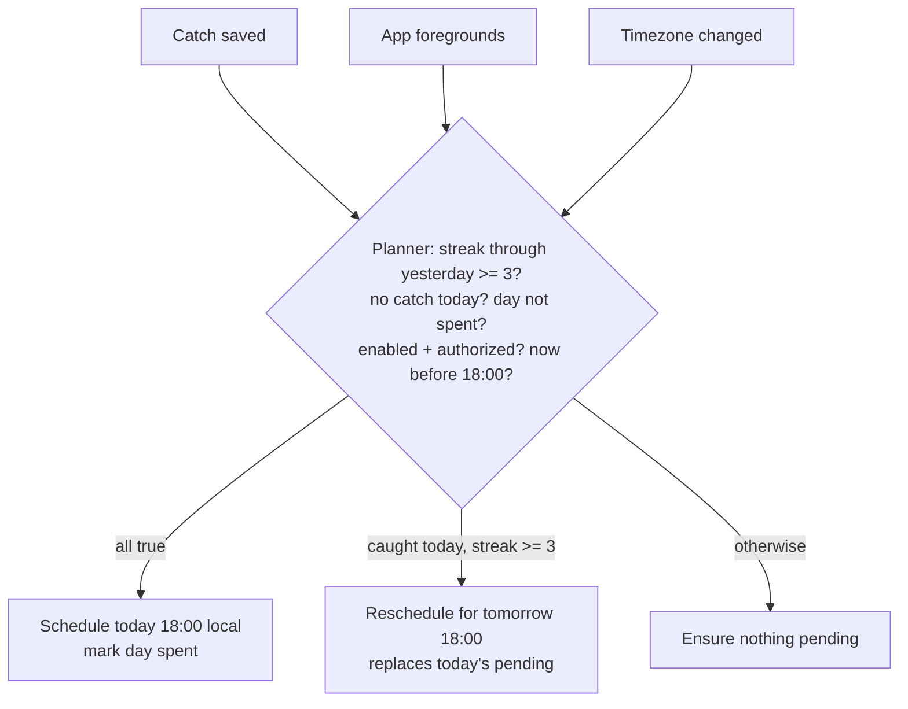

# Catch Streaks & Reminders - Plan

## Goal Capsule

- **Objective:** Ship daily catch streaks (current + longest on the Profile) and guardrailed local streak-protection reminders. This is the first v1.1 feature; three other v1.1 items key off the streak mechanic.
- **Product authority:** the v1.1 release scope doc (origin above) — its R1–R3, AE1–AE4, and its key decisions KD1/KD3 in that doc's own numbering, distinct from this plan's KD/KTD IDs — plus the four scope call-outs Noah confirmed 2026-08-17 (current-streak semantics, day-freezing, permission moment, Profile layout).
- **Stop conditions:** surface rather than guess if a change would touch the push/APNs surface, the trophy roster (parked), or a breaking SwiftData migration. Notification permission needs no Xcode capability or Info.plist string — if implementation appears to need one, stop and re-check before adding it.
- **Tail ownership:** field verification on Noah's phone (reminder delivery, permission flow) is part of done; TestFlight promotion stays Noah's.

Product Contract preservation: origin R1–R3 carried unchanged; R4–R7 added here to resolve gaps the origin left open (current-streak display semantics, foreground delivery, denied-permission Settings state, timezone day-freezing). No origin scope changed.

---

## Product Contract

### Summary

Add a shared streak computation to the trophy-metrics layer, show current + longest streak on the Profile, and pre-schedule at most one local notification ahead so a live 3+ day streak gets one early-evening nudge on days with no catch. Local UserNotifications only — no APNs, no new capabilities.

### Problem Frame

Nothing brings a user back daily (v1.1's core problem, per origin). The streak is the cheapest habit mechanic: the math already exists in the trophy layer, and streak protection never needed a server — a locally scheduled reminder covers it at a fraction of the push-alert cost.

### Key Decisions

- KD1. **Local notifications, not server APNs.** (session-settled: user-approved — chosen over the 2026-07-21 plan's server-computed streak alerts: no APNs key, no push capability, no privacy change; the shared cross-category frequency cap moves to v1.2 when push lands.) Governs R2, R3, R5.
- KD2. **Reminders on by default with hard guardrails.** (session-settled: user-directed — chosen over opt-in-default-off and cut-from-v1.1.) Governs R2, R3.
- KD3. **A live streak reads through yesterday until midnight.** (session-settled: user-approved — chosen over dropping to 0 at the day boundary: showing 0 at 00:01 after a 12-day run reads as data loss and makes the nudge nonsensical.) Governs R4.
- KD4. **Streak days freeze at catch time.** (session-settled: user-approved — chosen over live re-bucketing in the current timezone, which lets a Bali→SFO flight retroactively reshuffle streak days.) Governs R7.

### Requirements

Origin requirements (verbatim from the release scope doc):

- R1. The Profile shows a current streak and a longest streak, counted as consecutive local-calendar days with at least one catch.
- R2. A local streak-protection reminder fires only when all of these hold: a live streak of 3+ days, no catch yet that day, and no reminder already sent that day. It arrives in the early evening, cancels for the day once a catch lands, and never fires for a broken or absent streak.
- R3. Reminders are on by default, gated by the system notification permission requested with context (not at cold launch), and can be muted in Settings.

Added by this plan:

- R4. The current streak counts through yesterday when today has no catch yet; it reads 0 only after a full local day passes with no catch. When today is uncaught during a live streak of 3+ days, the Profile shows an at-risk hint rather than a lower number; shorter streaks show no at-risk state, matching reminder eligibility.
- R5. A delivered reminder is visible even when the app is foregrounded, and tapping it opens the app to the camera with a brief streak line (reusing the existing toast affordance).
- R6. When notification permission is denied, the Settings row renders disabled with an Open Settings action; enabling in iOS Settings heals on next foreground without a relaunch.
- R7. Each catch records its local calendar day at insert time; streak bucketing prefers that recorded day and falls back to current-zone bucketing for legacy rows.

### Acceptance Examples

- AE1. **Covers R2.** Given a 4-day streak and no catch today, when early evening arrives, exactly one reminder fires. Given a catch at 17:00 that day, no reminder fires.
- AE2. **Covers R2.** Given a 2-day streak, no reminder fires.
- AE3. **Covers R2.** Given a streak that broke yesterday, or a lapsed user, nothing fires.
- AE4. **Covers R3.** Given reminders muted in Settings, no reminder fires regardless of streak.
- AE5. **Covers R4.** Given catches on the last 12 days but none today at 09:00, the Profile shows a 12-day current streak with the at-risk hint; at 00:01 the next day with still no catch, it shows 0.
- AE6. **Covers R2.** Given the app foregrounds at 17:59 and again at 18:02 on a nudge day, only one reminder exists for that day (the spent-day marker blocks a second schedule).
- AE7. **Covers R7.** Given a catch at 06:00 in Bali (UTC+8), flying to SFO (UTC-7) does not move that catch to a different streak day.
- AE8. **Covers R2, R3.** Given permission was denied, no reminder is ever scheduled and the user is never re-prompted by the app.

### Scope Boundaries

- No trophy roster changes: the secret 7-day streak trophy stays secret (the trophy round is parked per the release doc). The trophy keeps reading `longestDayStreak` unchanged.
- No reminder-hour setting: 18:00 local is a fixed constant in v1.
- No push/APNs work, no Home Screen widget, no server-side streak awareness.
- No provisional notification authorization — explicit contextual ask only.
- Deferred to v1.2 (push train): the shared one-nudge-per-day cap across streak + overhead alert categories; per-category notification settings beyond this one toggle.

---

## Planning Contract

### Key Technical Decisions

- KTD1. **One shared streak computation in the trophy-metrics layer.** Add `currentConsecutiveDayRun(_:asOf:calendar:)` beside `longestConsecutiveDayRun` in `ios/Tailspot/Tailspot/Trophies.swift`, and a defaulted `currentDayStreak` field on `TrophyProgressInputs`. The day-set itself has one owner: an extracted `dayBuckets(from:calendar:)` helper in Trophies.swift holding the dayKey-else-startOfDay rule — `Trophies.inputs` calls it, and it is the single source for the reminder planner's `days:` input, so no second bucketing implementation can drift (flow-analysis gap M6). Thread `inputs` into the Profile stats UI; do not add Calendar work to `ProfileStats` or any computed property (the 2026-07 Profile freeze lesson — stats are computed once at `ProfileScreen.swift:66-67` and passed down).
- KTD2. **Schedule-one-ahead planner: pure decision function + thin scheduler.** A `nonisolated` pure function takes `(days, now, calendar, lastScheduledDay, enabled, authorized)` and returns `.schedule(targetDay)` / `.cancel` / `.noop`. Remove-then-add on a single request identifier means a reschedule replaces any pending request, so "caught today with a live 3+ streak" returns `.schedule(tomorrow)`. The trigger is a `UNCalendarNotificationTrigger` with full year/month/day components for the target day at 18:00, `timeZone` left nil so it floats with the device's zone (hour-only components could not distinguish today's 18:00 from tomorrow's). UserNotifications has no synchronous API, so the authorization status is cached in UserDefaults (refreshed on every foreground); the decision stays pure and synchronous, and a thin async wrapper applies it in a `Task` at three points: immediately after `modelContext.save()` in the capture path, on `scenePhase == .active`, and on the system timezone-change notification. A force-kill between save and apply can leave a stale nudge; the next foreground recompute repairs it (gap M4's guarantee is repair-on-foreground, not a synchronous write). Never-nag-lapsed is structural: a broken streak schedules nothing.
- KTD3. **Spent-day marker in UserDefaults.** `tailspot.streak.lastReminderScheduledDay` records the day a reminder was scheduled for; a day is spent once scheduled, regardless of delivery (gap M3). Key follows the dotted `@AppStorage` convention, declared as a `static let` on a namespace enum with `defaults:` injection for tests, mirroring `CatchTelemetry`.
- KTD4. **Day-freezing via an optional `dayKey` on `Catch`.** New optional String (`"yyyy-MM-dd"`, local calendar at insert). Additive SwiftData field with nil default — a lightweight migration per the repo rule. Bucketing prefers `dayKey`, falls back to current-zone `startOfDay` for legacy rows. The Hangar-restore path also sets `dayKey` (best-effort from `caughtAt` in the current calendar) so restored collections are not permanently unfrozen. Instantiates KD4; governs R7.
- KTD5. **Permission ask at the day-3 reveal dismiss.** (session-settled: user-approved — chosen over asking at first catch or in onboarding: the reveal-dismiss of the catch that completes a 3-day streak is the highest-context moment, and onboarding's 3-step funnel must not churn.) A one-line pre-prompt sheet precedes the system prompt (the onboarding two-beat pattern). Eligibility requires all of: streak exactly 3, permission not determined, ask never latched, and reminders enabled in Settings — a pre-emptively muted user is never asked. The pre-prompt fires only on a reveal dismiss with no suspect-review dialog pending; the existing flush-point ordering wins the contested moment. The one-shot latch mirrors `firstCatchFired` and is set on any dismissal of the pre-prompt, accept or decline — one shot either way; denial is never re-asked (R6 handles recovery). Outcome reported via the existing `firePermissionOutcome(permission:granted:)`.
- KTD6. **Delegate + presentation.** A small `NotificationCoordinator: NSObject, UNUserNotificationCenterDelegate` assigned in `TailspotApp.init()` (before launch completes): foreground presentation returns banner + sound; tap lands on the camera root and surfaces the streak line (gap H2/H3). The delegate-to-view channel is a small `@Observable` `StreakToastRelay` owned by `TailspotApp` and injected via `.environment` — the three existing toasts are private `ContentView` state with hardcoded copy, so there is nothing cross-boundary to reuse. `ContentView` folds all four toasts (grounded / far-tap / save-fail / streak) into one shared optional banner state so exactly one is visible at a time. Notification content: default sound, no badge, `.active` interruption level, body naming the streak length, dried voice.

### High-Level Technical Design

One planner decision, evaluated at three trigger points; the notification store never holds more than one pending request.

The planner never reads `Date()` or the notification center directly — the caller passes `now`, the day-set, and stored state, which is what makes AE1–AE8 unit-testable in the existing fixed-epoch style.

### Risks & Dependencies

- **Duplicate-rule sequencing.** Under today's lifetime dedup, a day whose only reveal is a duplicate writes no row — the streak misses the day and the nudge false-fires ("you haven't caught anything" right after a catch). The narrowed same-airframe+callsign+day rule (same release, separate item) makes duplicate-only days impossible. Land that rule before or with this feature; if it slips, accept the rare false nag rather than adding a reveal-marker workaround.
- **Existing rows have no `dayKey`.** Mixed bucketing (frozen vs current-zone) can shift a legacy streak once, on a timezone change. Accepted: converges as new catches accrue, and the restore path writes best-effort keys, so only pre-feature rows stay unfrozen.
- **Foreground `.active` work grows.** The recompute joins registration/sync/upload on the foreground hook; it is cheap (one fetch of `caughtAt`s + one pure function) and must run on the main actor, not inside the upload `Task`.

---

## Implementation Units

### U1. Streak computation + day freezing

- **Goal:** one shared, testable source of streak truth.
- **Requirements:** R1, R4, R7 (KTD1, KTD4).
- **Dependencies:** none.
- **Files:** `ios/Tailspot/Tailspot/Trophies.swift`, `ios/Tailspot/Tailspot/Catch.swift`, `ios/Tailspot/Tailspot/HangarRestore.swift`, `ios/Tailspot/TailspotTests/StreakLogicTests.swift` (new), `ios/Tailspot/TailspotTests/TrophiesTests.swift`.
- **Approach:**
  1. Add `dayKey` optional String to `Catch`; set at insert in the capture path and in the Hangar-restore path (best-effort from `caughtAt`); never backfilled elsewhere.
  2. Extract `dayBuckets(from:calendar:)` in Trophies.swift owning the dayKey-else-`startOfDay` rule; `Trophies.inputs` calls it, and it is the single source for the reminder planner's `days:` input (KTD1).
  3. Add `currentConsecutiveDayRun(_:asOf:calendar:)` beside `longestConsecutiveDayRun` — a run counting through `asOf`'s day or the day before (R4 semantics).
  4. Add defaulted `currentDayStreak` to `TrophyProgressInputs` and a defaulted `asOf: Date = Date()` parameter to `Trophies.inputs` so the computation never reads a hidden clock; existing call sites and tests compile unchanged.
- **Patterns to follow:** `nonisolated` pure statics with injected `Calendar`; `TrophyProgressInputs` defaulted-param convention.
- **Test scenarios:**
  - Covers AE5. 12 consecutive days ending yesterday, asOf today-09:00 → current 12; asOf next-day-00:01 with no new catch → 0.
  - Catch today only → current 1; gap two days ago → run resets.
  - Covers AE7. `dayKey` present: bucketing ignores the calendar's zone; legacy nil rows fall back to `startOfDay`.
  - Restored rows get a best-effort `dayKey`; bucketing treats them like captured rows.
  - Existing `longestConsecutiveDayRun` results unchanged (regression pin, incl. the 7-day trophy input).
  - DST boundary days (23/25-hour) count as single days — pin with an explicit `TimeZone`.
- **Verification:** `TailspotTests` green; no change to trophy unlock results on existing fixtures.

### U2. Profile streak display

- **Goal:** current + longest streak visible on the Profile (R1, R4).
- **Requirements:** R1, R4 (KTD1).
- **Dependencies:** U1.
- **Files:** `ios/Tailspot/Tailspot/ProfileScreen.swift`, `ios/Tailspot/TailspotTests/ProfileSettingsSnapshotTests.swift`, `ios/Tailspot/TailspotTests/DynamicTypeSnapshotTests.swift`.
- **Approach:** second stats row (STREAK / BEST) under the existing 4-cell `statsStrip`, reading `inputs.currentDayStreak` / `inputs.longestDayStreak` from the already-computed `inputs`; at-risk hint (accent color via the existing `valueColor:` mechanism plus a short mono sub-label) only when the streak is 3+ days and today is uncaught (R4).
- **Patterns to follow:** `statCell(value:label:valueColor:)`; `Brand.Font.mono` labels; no new computed properties on the view.
- **Test scenarios:**
  - Snapshot: streak row at 0 / live / at-risk states, plus a large Dynamic Type render.
  - At-risk hint shows only when current streak ≥3 and today uncaught; a 2-day streak shows the plain number.
- **Verification:** snapshot tests green; ImageRenderer visual pass (before/after PNGs, edge cases: 0-day, 365-day, at-risk) reviewed before deploy.

### U3. Reminder planner + scheduler

- **Goal:** the R2 guardrails as a pure function, applied through one thin scheduler.
- **Requirements:** R2, R3 (KTD2, KTD3).
- **Dependencies:** U1.
- **Files:** `ios/Tailspot/Tailspot/StreakReminders.swift` (new), `ios/Tailspot/TailspotTests/StreakRemindersTests.swift` (new).
- **Approach:** `StreakReminders` namespace enum: pure `decision(days:now:calendar:lastScheduledDay:enabled:authorized:)` returning `.schedule(targetDay)` / `.cancel` / `.noop` per KTD2; thin async wrapper applying it via `UNUserNotificationCenter` (single request identifier, remove-then-add; full date components in the trigger); spent-day marker per KTD3; notification content per KTD6.
- **Execution note:** build the decision function test-first — the guardrail matrix is the spec.
- **Test scenarios:**
  - Covers AE1. Streak 4 through yesterday, no catch today, 09:00, day unspent → `.schedule(today)`. Catch at 17:00 → `.schedule(tomorrow)`, which replaces today's pending request.
  - Covers AE2/AE3. Streak 2 → no-op; streak broken yesterday → no-op (and cancels any stale pending).
  - Covers AE4/AE8. `enabled == false` or `authorized == false` → no-op and cancel.
  - Covers AE6. Day already spent → no-op on the 18:02 re-foreground.
  - After a catch today with resulting streak ≥3 → schedule tomorrow 18:00.
  - Now past 18:00, unspent, no catch → schedule tomorrow (not today).
- **Verification:** `TailspotTests` green; decision matrix fully covered.

### U4. Delegate, tap handling, and lifecycle wiring

- **Goal:** reminders visible and actionable in every app state; recompute at the three trigger points.
- **Requirements:** R2, R5 (KTD2, KTD6).
- **Dependencies:** U3.
- **Files:** `ios/Tailspot/Tailspot/TailspotApp.swift`, `ios/Tailspot/Tailspot/NotificationCoordinator.swift` (new), `ios/Tailspot/Tailspot/ContentView.swift`.
- **Approach:**
  1. `NotificationCoordinator` assigned in `TailspotApp.init()`; foreground presentation banner+sound; tap writes the streak line to the `StreakToastRelay` (KTD6) injected via `.environment`; `ContentView` folds all four toasts into one shared optional banner state so only one shows at a time.
  2. Recompute hooks: a `Task` fired right after `modelContext.save()` in `performCatch` (decision computed synchronously from cached state per KTD2); the `scenePhase == .active` branch (outside the upload `Task`); a timezone-change observer.
  3. Analytics: `streak_reminder_scheduled` / `streak_reminder_opened` via the `CatchTelemetry` builder/wrapper pattern.
- **Patterns to follow:** delegate callbacks hop to the main actor (MainActor default isolation — mark the coordinator's conformance correctly); `Log.*`, never `print`; mind the ContentView type-check budget — bundle any view-chain additions into one ViewModifier.
- **Test scenarios:**
  - Analytics property builders pinned (pure functions).
  - Test expectation: delegate/lifecycle glue itself — none; covered by U3's decision tests plus the device pass below.
- **Verification:** device pass on Noah's phone: reminder delivered foreground + background + app-killed; tap opens camera with the streak toast; catching before 18:00 verifiably cancels (check the pending-request list in a debug log line).

### U5. Permission flow

- **Goal:** the contextual ask, once, at the right moment (R3).
- **Requirements:** R3 (KTD5).
- **Dependencies:** U3.
- **Files:** `ios/Tailspot/Tailspot/ContentView.swift` (reveal dismiss hook), a small pre-prompt view (new file or alongside the coordinator), `ios/Tailspot/TailspotTests/StreakRemindersTests.swift`.
- **Approach:** on reveal dismiss, if the just-saved catch made the current streak exactly 3, permission is `.notDetermined`, the ask never fired, reminders are enabled in Settings, and no suspect-review dialog is pending (the existing flush-point ordering wins): present the one-line pre-prompt sheet → on accept, request authorization. Latch `tailspot.reminders.permissionAsked` on any dismissal of the sheet, accept or decline; report outcome via `firePermissionOutcome(permission: "notifications", granted:)`.
- **Test scenarios:**
  - Ask-eligibility as a pure function: streak==3 exactly, not-determined, unlatched, enabled-in-Settings → eligible; each condition false → not.
  - Latch prevents a second ask after denial, grant, or a dismissed-without-deciding sheet (no re-ask on a later streak rebuild).
- **Verification:** device pass: prompt appears after the day-3 reveal dismiss, not over the reveal ceremony; deny → no future prompts, Settings row shows the denied state (U6).

### U6. Settings REMINDERS section

- **Goal:** the mute toggle with an honest denied state (R3, R6).
- **Requirements:** R3, R6.
- **Dependencies:** U3.
- **Files:** `ios/Tailspot/Tailspot/SettingsScreen.swift`, `ios/Tailspot/TailspotTests/ProfileSettingsSnapshotTests.swift`.
- **Approach:** new REMINDERS section between SPOTTER and ABOUT, matching the existing section chrome; `@AppStorage("tailspot.reminders.streakEnabled")` default true (key on a namespace enum); when authorization is `.denied`, grey out and disable the Toggle control only — the Open Settings action stays interactive (`.disabled` cascades to children, and disabling the whole row would kill the recovery path) — with a subtitle, following the spirit of the `PermissionRecoveryCard` copy; re-read `notificationSettings()` on foreground so enabling in iOS Settings heals (R6). Toggling off cancels any pending request immediately.
- **Test scenarios:**
  - Snapshot: REMINDERS section in enabled / muted / permission-denied states.
  - Toggle-off cancels: decision function returns cancel when `enabled == false` (already pinned in U3; here verify the wiring passes the stored value).
- **Verification:** snapshot green; device check of the denied → Open Settings → heal-on-return loop.

---

## Verification Contract

| Gate | Command / method | Applies to |
|---|---|---|
| Unit tests | `xcodebuild test -project ios/Tailspot/Tailspot.xcodeproj -scheme Tailspot -destination 'platform=iOS Simulator,name=iPhone 17,OS=latest' -only-testing:TailspotTests` | every unit; required green before merge (branch-protected main) |
| Visual pass | ImageRenderer PNGs of the Profile streak row + Settings section, edge cases rendered, reviewed before deploy | U2, U6 |
| Device field test | `bin/deploy`; verify reminder delivery in all three app states, cancel-on-catch, permission flow, toast-on-tap | U4, U5, U6 |

Time-dependent behavior is testable because every decision function takes `now`/`asOf` — never `Date()` (repo test convention).

## Definition of Done

- R1–R7 hold on device; AE1–AE8 each covered by a test or the scripted device pass.
- All six units landed, `TailspotTests` green in CI, snapshot suites updated intentionally (no accidental diffs).
- Visual pass reviewed; field test on Noah's phone completed for the U4/U5/U6 device checks.
- The repo's `PLAN.md` §9 status updated when the feature merges (doc-staleness hook will enforce).
- No leftover debug scaffolding, no push capability or entitlement added, trophy roster untouched.
