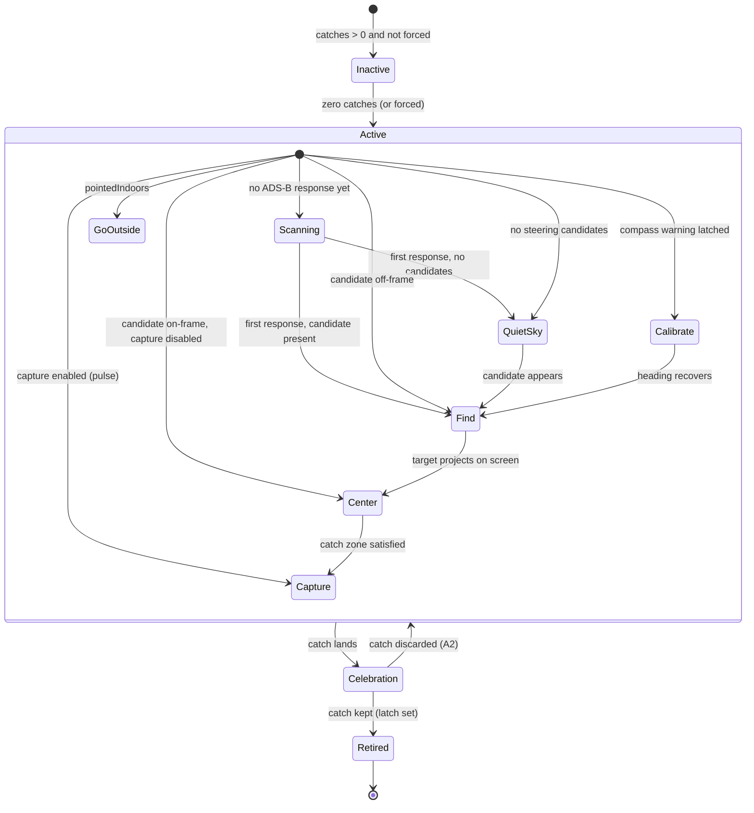
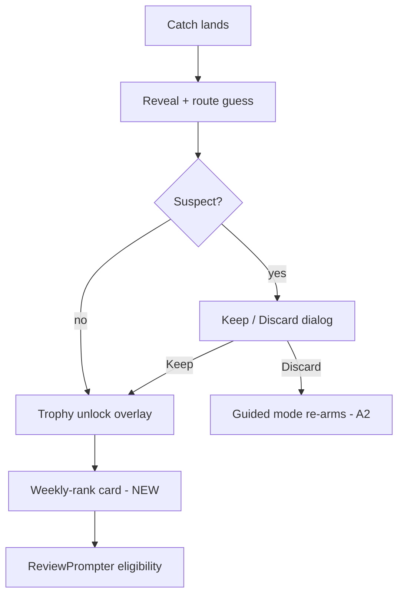

# First Catch Experience - Plan

## Goal Capsule

- **Objective:** A person who installs Tailspot and never catches a plane becomes rare. The first catch teaches the whole game — spot, center, capture, reveal with route guess and trophy — and ends with the user seeing their place on the weekly leaderboard. Measured as zero-catch → first-catch activation rising from the 44% post-GA baseline.
- **Means:** a guided first-catch mode layered onto the existing viewfinder (KD2), retiring after the first kept catch.
- **Product authority:** Noah's 2026-08-27 brainstorm verdicts (KD1–KD5, R10), on top of the 2026-08-17 Flight Plan board. The HTML sibling of this file is the original requirements artifact; this file is canonical.
- **Stop conditions:** stop and surface if the work would need a backend change (none is planned), a non-additive SwiftData change, or a ContentView restructuring beyond riding existing overlay links — each is a scope change Noah must see.
- **Product Contract preservation:** unchanged from the requirements artifact (format conversion only; wireframes remain in the HTML sibling).

---

## Product Contract

### Summary

A guided first-catch mode for any user with zero catches: the viewfinder actively steers them to the nearest catchable plane, coaches the center-and-capture mechanic with a visually loud capture affordance, and says so honestly when the sky is quiet. The first catch runs the full existing loop — reveal, route guess, First Catch trophy — and lands on a new "your place this week" moment on the existing weekly leaderboard.

### Problem Frame

Since GA (2026-08-08), 66 new people opened the app and only 29 ever caught a plane (44%). Onboarding is not the leak: 94% finish it, ~95% grant both permissions, and the AR view starts for 61 of 66. The leaks come after. Leak 1: 21 users (32%) had a catchable plane nearby and never caught — zero of them ever tapped a plane label; 9 never touched the screen again, 6 tapped empty sky (one hunted 40 taps across 3 sessions), 5 saw only the compass caution, 1 was denied once for a grounded plane. Nine returned across 2–4 sessions and still stalled. Leak 2: 11 users got a working AR view and never had a plane in range. Three verified mechanics explain leak 1: catching requires aim (tight central catch zone; lone-plane and tap-pin exceptions), the capture button's only enabled signal is an opacity change, and nothing steers a user toward an in-range but off-frame plane.

### Key Decisions

- KD1. **The trigger is zero catches, not first launch.** (session-settled: user-directed — chosen over fresh-installs-only and a re-engagement nudge: reaches the 37 existing never-activated users without notification scope.) Governs R1.
- KD2. **Guidance is live coaching on the real sky, not a canned tutorial, quest card, or relaxed catch rule.** (session-settled: user-approved — chosen over a quest checklist, a radar-first flow, and first-catch aim relaxation: attacks the verified aim gap without clutter and keeps the catch earned.) Governs R2, R3, R4.
- KD3. **Simulated first catch stays parked.** (session-settled: user-directed — 2026-08-17 board verdict: teaching happens only on real planes.)
- KD4. **The first-catch payoff lands on the weekly leaderboard window.** (session-settled: user-directed — chosen over the all-time board: climbable for a one-catch user; the weekly window already shipped.) Governs R8.
- KD5. **When the compass is bad, guidance degrades honestly instead of mis-steering.** (session-settled: user-approved — mis-steering on a bad heading teaches distrust.) Governs R5.

### Requirements

**Guided catch mode**

- R1. The guided first-catch experience is active for any user with zero catches — fresh installs and existing users alike — and retires permanently once their first kept catch completes the celebration; a discarded catch leaves the mode active (A2).
- R2. When a catchable plane is in range but not in frame, the viewfinder steers the user toward it: which way to turn, roughly how far away it is, and what it is.
- R3. Coaching names the current mechanic one step at a time — find the plane, center it, capture — advancing on the user's actual state rather than on a timer.
- R4. The capture affordance becomes visually loud (a pulse or equivalent) the moment a catch is possible, replacing the current opacity-only signal.
- R5. When heading accuracy is poor, guidance stops steering and says so — prompting calibration — rather than pointing arrows on a heading it can't trust. Per KD5.

**Quiet sky**

- R6. When nothing catchable is in range, the guided experience says so honestly — the sky is quiet, the app is not broken — and sets an expectation for when to try again, without promising traffic it can't predict.

**Completing the loop**

- R7. The first catch runs the full existing loop unchanged: the reveal card, the route-guess bonus round, and the First Catch trophy.
- R8. After the first-catch celebration completes, the user is shown their place on the THIS WEEK leaderboard window. Per KD4.

**Measurement**

- R9. Telemetry can tell whether this worked: events distinguish "a plane label actually rendered on screen" and "the user tapped a visible label". Existing event semantics are preserved.

**Testability**

- R10. A Debug-build-only override forces the guided first-catch experience on a device that already has catches, so the flow is field-testable end to end without touching stored catches, the account, or the Hangar. While forced, the screen is visibly badged as debug and the run emits none of the activation-funnel analytics.

### Key Flows

- F1. **Zero-catch user, plane in range** — steering (R2) → coaching advances (R3) → capture goes loud (R4) → catch → reveal, guess, trophy (R7) → weekly rank (R8) → mode retires (R1).
- F2. **Zero-catch user, quiet sky** — honest quiet-sky state with a return expectation (R6); next session with traffic, F1 runs.
- F3. **Bad compass during guidance** — steering stops, calibration prompt shows (R5); steering resumes when heading recovers.

### Acceptance Examples

- AE1. **Covers R1.** Given one of the 37 existing zero-catch users updates and opens the app, the guided experience is active. Given a user with one catch, nothing from this plan appears.
- AE2. **Covers R2.** Given a catchable plane 4 km away behind the user, the viewfinder tells them which way to turn before any label is on screen.
- AE3. **Covers R4.** Given a plane enters the catch zone, the capture affordance visibly changes beyond opacity; given the zone empties (and no lone-plane or pinned exception applies), it returns to quiet.
- AE4. **Covers R5.** Given heading accuracy is poor, no directional steering is shown — the calibration prompt is, and steering returns when accuracy recovers.
- AE5. **Covers R6.** Given no catchable traffic in range, the user sees the quiet-sky state rather than an empty viewfinder; it does not claim traffic is coming at any specific time.
- AE6. **Covers R8.** Given the first catch's celebration finishes, the user sees their rank on the THIS WEEK window — not the all-time board.
- AE7. **Covers R9.** Given a labeled plane renders on screen and the user never taps it, the funnel can distinguish that user from one whose plane never appeared on screen.
- AE8. **Covers R10.** Given the debug override on Noah's device (~1,000 catches), the full guided flow runs — steering, coaching, pulse, quiet sky, weekly-board ending — with the debug badge visible; turning it off restores normal behavior, stored data is byte-identical, and no activation events from the forced run reach analytics.
- AE9. **Covers R3.** Given a catchable plane off-frame, coaching shows the find step; given the target projects on screen, it advances to center; given capture enables, it advances to capture — never on a timer.
- AE10. **Covers R7.** Given a kept first catch, the reveal card, route-guess round, and First Catch trophy run in their existing sequence, unmodified by guided mode.

### Success Criteria

- Zero-catch → first-catch activation for new users rises from the 44% baseline (66 → 29 since GA). Directional target: ~60%, re-baselined once R9's events land — the baseline window starts when U4 ships, ahead of the guided mode.
- The "plane nearby but never caught" cohort (32% of new users today) shrinks, measured with R9's events rather than the ambiguous `first_plane_seen`.
- Median first-open → first-catch stays in the ~10-minute band for users with traffic in range.

### Scope Boundaries

- The three-step onboarding (welcome → permissions → handle) is untouched — the data cleared it as a leak.
- No quest/checklist card, no first-catch aim-gate relaxation, no simulated first catch (KD2, KD3).
- No re-engagement notifications for lapsed zero-catch users.
- The leaderboard itself is unchanged; this plan adds only the first-catch landing moment on the existing weekly window. No backend change.
- Coverage itself (why leak 2's skies are quiet) is separate work — the FAA SWIM spike and backend coverage options live outside this plan.

### Assumptions

Pipeline-mode defaults chosen during planning; each is cheap to reverse if Noah redirects at review:

- A1. The R4 capture pulse ships to guided mode only this round; promoting it to all users is a deliberate one-line follow-up once Noah has seen it live — the measured evidence comes from the zero-catch cohort, and capture-surface motion is a taste call Noah adjudicates. (Resolves origin OQ2 conservatively.)
- A2. A **discarded** first catch re-arms the guided mode (R1's retirement latch is set only when the catch resolves as kept). The once-per-install `first_plane_catch` event will already have fired for that user; accepted, since R9's new events carry the funnel.
- A3. Steering's affordance is an **edge arrow plus a compact tag** (bearing hint, distance, plane id), per the origin wireframe; exact motion and placement are settled at implementation with a visual pass. (Resolves origin OQ1.)
- A4. The weekly-rank moment is a **condition-gated overlay card** in the existing post-reveal arbitration, not a new screen or sheet. (Resolves origin OQ4.)
- A5. The rank fetch pre-warms as soon as the first catch's upload succeeds, and the card mounts only once the fetch resolves. If the upload has not confirmed, or the fetch has not resolved, within ~3 s of the trophy queue draining, the moment degrades to rank-free copy ("THIS WEEK's board is waiting") with a tap-through to the leaderboard — the card always renders and never blocks the celebration.
- A6. Coaching copy and quiet-sky copy are written at implementation in the app's dried voice; the quiet-sky line must not promise traffic timing. (Resolves origin OQ3.)

---

## Planning Contract

### Key Technical Decisions

- KTD1. **One `GuidedCatch` funnel owns all guided-mode state.** A single engine derives "mode active", the current coaching step, and the steering target from inputs (catch count, observed traffic, lock-on state, compass state, indoors state). The R10 debug override feeds a synthetic *input* (`forcedZeroCatches`) into this one seam — never a per-reader output override. (session-settled: user-directed — chosen over testing via a second account: Noah field-tests on his ~1,000-catch device; instantiates R10, mirrors the `StreakDebug` → `Streaks.summary` pattern, `ios/Tailspot/Tailspot/Streaks.swift:92-101, 232-311`.) Governs R1, R10.
- KTD2. **Retirement is a persisted latch, not a live zero-catch check.** A UserDefaults latch (patterned on `CatchTelemetry.firstCatchFiredKey`) is set when the first catch resolves as kept — immediately for a non-suspect catch, after Keep for a suspect one. Discard leaves it unset (A2). Cites R1; prevents the trophy/telemetry-vs-Discard inconsistency found in flow analysis.
- KTD3. **Steering candidates are the label pipeline's own set.** Candidates: airborne, `visibilityTier != .hidden`, clearing the catch size floor — the exact set the label loop renders. `isLikelyVisibleToObserver` is purely geometric (grounded check, elevation floor, slant-distance bands, `ADSBManager.swift:223-246`) with no frame or orientation input, so off-frame planes already pass it; reusing it avoids a parallel range definition that could drift and steer at a plane the tier computation classifies hidden. The set is computed at the observed-publish site on the MainActor and passed into the engine as input (tier properties are MainActor-isolated). While `pointedIndoors` is latched, coaching shows the go-outside step instead of arrows (steering someone indoors recreates a solved failure class). Target = nearest by slant with hysteresis (hold the current target until it leaves range or a ~20%-closer candidate appears) so the arrow doesn't flip between polls. Governs R2 mechanics.
- KTD4. **The weekly-rank moment joins the existing post-reveal arbitration, last before the review prompter.** Order after reveal dismissal: suspect Keep/Discard → trophy unlock overlay → weekly-rank card → `ReviewPrompter`. The rank fetch pre-warms on upload success, in parallel with the reveal sequence (the backend reports `rank: 0` for zero in-window points until then, `backend/src/identity/store.ts:688`), reusing `TailspotAccountClient.leaderboard(window:)` and the `LeaderboardStandingCache` shape; on a pending or failed upload the card degrades per A5 rather than skipping — the moment always renders. Governs R8 sequencing; A5 owns the failure copy.
- KTD5. **Guided coaching supersedes the ambient compass badge.** R5 reads the existing latched `showCompassWarning` signal (±25° arm, 4 s debounce — one threshold, one state machine); while guided mode is active the coaching prompt replaces the ambient `cautionBadge` rather than stacking with it. (session-settled: user-approved — instantiates KD5; cites R5.)
- KTD6. **The forced-mode loop is fully simulated except a real read-only rank fetch.** The debug flow extends the existing `simulateCatch()` / `reveal.isSimulated` pattern (no `Catch` row, no upload, telemetry guarded at fire sites) through a locally synthesized trophy moment and a weekly-rank card showing Noah's real rank with the debug badge. `Analytics._testSink` stays a test-only seam; production suppression uses `isSimulated`-style guards. Governs R10, AE8.
- KTD7. **All new viewfinder chrome rides existing ContentView links.** ContentView.body is at the type-checker's expression budget; new UI mounts inside the existing `TimelineView` ZStack, the existing `.overlay` groups, and one bundled ViewModifier — never new chain links. New toasts, if any, become `TopToast` cases in the single shared slot. Constrains U2, U3.

### High-Level Technical Design

Guided-mode step derivation (directional; the engine recomputes on each observed/pose publish):

Post-catch arbitration (KTD4; only the weekly-rank card is new):

---

## Implementation Units

### U1. GuidedCatch engine and the single trigger seam

- **Goal:** One testable engine owning mode activation, the retirement latch, step derivation, and steering target selection.
- **Requirements:** R1, R2 (selection), R3 (step state), R5 (state), R10 (seam). KTD1, KTD2, KTD3.
- **Dependencies:** none.
- **Files:** `ios/Tailspot/Tailspot/GuidedCatch.swift` (new), `ios/Tailspot/TailspotTests/GuidedCatchTests.swift` (new).
- **Approach:**
  1. Pure step-derivation function: inputs are catch count (or forced synthetic zero), a first-ADS-B-response flag (mirrors `emptySkyOverlay`'s never-fetched case — QuietSky must not fire before data has loaded), indoors flag, compass-warning flag, steering candidates, on-frame projection of the target, and capture-mode enablement; output is the guided step per the state diagram. Guard order when conditions co-occur: Scanning > GoOutside > Calibrate > QuietSky > Find/Center/Capture.
  2. Nearest-with-hysteresis target picker over the caller-supplied candidate set (per KTD3; `bearingDeg`/`elevationDeg`/`slantDistanceMeters`, `ADSBManager.swift:25-30`); nil-heading input returns no steering (heading can be nil pre-fix, `LocationManager.swift:89-91`).
  3. Off-frame direction from `Geo.cameraFrameVector` (the `recordEmptySkyTapDiagnosis` shape, `ContentView.swift:4011-4060`), including behind-camera.
  4. Persisted retirement latch + `#if DEBUG` `GuidedCatchDebug` override reading UserDefaults (`StreakDebug` pattern), applied only inside the engine's activation derivation.
- **Patterns to follow:** `Streaks.summary` single-funnel override; `EmptySkyTapSubjectTests` pure-function test shape; `ClosestTargetTests`/`CameraBasisTests` for projection math.
- **Test scenarios:**
  - Covers AE1. Zero catches → active; one catch + latch set → inactive; forced override on a 1,000-catch fixture → active.
  - Covers AE2. Candidate behind the observer yields a turn direction and distance with no on-screen projection.
  - Covers AE4. Compass-warning input forces the Calibrate step regardless of candidates; recovery returns to Find/Center.
  - Covers AE5. No candidates → QuietSky step; indoors flag → GoOutside step even with candidates.
  - Never-fetched input → Scanning state, not QuietSky; QuietSky requires at least one ADS-B response.
  - Covers AE9. Step advancement find → center → capture follows target projection and capture enablement, never elapsed time.
  - Hysteresis: a 5% closer new plane does not steal the target; a 25% closer one does; target leaving range re-picks.
  - Latch: kept catch sets it; discarded catch leaves it unset and the mode re-derives active (A2).
- **Verification:** unit tests green; engine has no SwiftUI imports (pure, `nonisolated` where possible per `ios/CLAUDE.md` isolation rules).

### U2. Viewfinder chrome: steering, coaching, pulse, quiet sky

- **Goal:** Render the guided experience — step banner, edge arrow + tag, capture pulse, quiet-sky and calibrate states — without growing ContentView's expression budget.
- **Requirements:** R2, R3, R4, R5 (presentation), R6. KTD5, KTD7. A1, A3, A6.
- **Dependencies:** U1.
- **Files:** `ios/Tailspot/Tailspot/GuidedCatchOverlay.swift` (new view + one bundling ViewModifier), `ios/Tailspot/Tailspot/ContentView.swift` (mount points only), `ios/Tailspot/TailspotTests/GuidedOverlaySnapshotTests.swift` (new).
- **Approach:**
  1. Edge arrow + tag draw inside the existing `TimelineView` ZStack (`ContentView.swift:347`) using the same effective hfov/vfov as the label loop (zoom shrinks FOV).
  2. Step banner mounts where `cautionBadge`/`indoorHintBanner` live; while guided mode is active it supersedes the ambient compass badge (KTD5) and the indoor hint (GoOutside step carries that copy).
  3. Capture pulse extends `captureButton` via the `EmptyPulse` ViewModifier pattern (`ContentView.swift:4454`), keyed on capture enablement, guided mode only this round (A1).
  4. Quiet-sky copy extends `emptySkyOverlay(rawCount:)` (`ContentView.swift:3241`), which already distinguishes transport error from truly-empty — backend outage must render as the error state, never as "quiet sky" (R6 honesty). The same error-wins rule covers every guided step: when `adsb.lastError` is set, the steering arrow, tag, and pulse suppress in favor of the existing error surface — never steer on stale extrapolated positions.
  5. Permission-recovery and Hangar-restore overlays keep priority: guided chrome renders below them and hides while either shows (a reinstall wipes the retirement latch, so guided mode can be active while restore is pending).
- **Execution note:** render before/after snapshots (ImageRenderer → PNG) for every step state and actually look at them; green build is not a layout check.
- **Test scenarios:**
  - Snapshot each step state (GoOutside, QuietSky, Calibrate, Find with arrow left/right/behind, Center, Capture-pulse) at fixed sizes, incl. long plane-name tag truncation.
  - Covers AE3. Pulse present when capture enabled; absent (and opacity dim) when disabled.
  - Guided active + compass warning → coaching calibrate banner shown, ambient badge suppressed; guided inactive → ambient badge unchanged.
  - Quiet-sky state with `lastError` set shows the error surface, not quiet-sky copy.
  - Feed error mid-guidance (`lastError` set while steering): arrow, tag, and pulse suppressed in favor of the error surface.
- **Verification:** `TailspotTests` green; CI build time not degraded (type-check budget respected — no new body chain links); visual pass reviewed.

### U3. Weekly-rank landing moment

- **Goal:** After the first catch's celebration, show the user's THIS WEEK rank; set the retirement latch at the right moment.
- **Requirements:** R1 (latch timing), R7 (sequence preserved), R8. KTD2, KTD4. A4, A5.
- **Dependencies:** U1.
- **Files:** `ios/Tailspot/Tailspot/WeeklyRankCard.swift` (new), `ios/Tailspot/Tailspot/ContentView.swift` (arbitration gate), `ios/Tailspot/TailspotTests/WeeklyRankMomentTests.swift` (new).
- **Approach:**
  1. Card rides the condition-gated overlay pattern (`trophyUnlockOverlay`, `ContentView.swift:1477-1485`) with an added gate: shows only when `pendingReveal == nil`, suspect review resolved, and the trophy queue is drained; `ReviewPrompter` eligibility waits behind it (KTD4).
  2. Rank via `TailspotAccountClient.leaderboard(window: .week)` → `me.rank`, pre-warmed on upload success in parallel with the reveal; the card mounts only once resolved, with A5's ~3 s budget covering both a pending upload and a slow fetch; cache last-good via the `LeaderboardStandingCache` shape (the forced-mode fetch skips the cache write so AE8's byte-identical check holds, per KTD6).
  3. Retirement latch (U1) set here: non-suspect catch → on insert; suspect → on Keep.
- **Test scenarios:**
  - Covers AE6. Kept first catch → card shows week window rank, not all-time.
  - Suspect first catch: card never shows before Keep/Discard resolves; Discard → no card, mode re-arms (A2).
  - Fetch failure/timeout → fallback copy, celebration not blocked.
  - Upload pending or offline at arbitration time → the rank-free fallback card shows (the offline field catch); celebration not blocked, and the moment is never silently skipped.
  - Covers AE10. Kept first catch runs reveal → route guess → trophy unmodified before the rank card.
  - Second catch → no card (moment is first-catch only).
  - Integration: arbitration order suspect → trophies → rank holds with all three pending; `ReviewPrompter` (drop-and-retry with `minimumCatches = 3`) is expected to drop on a first catch, not defer.
- **Verification:** unit + snapshot tests green; on-device pass confirms the sequence after a real catch.

### U4. Activation telemetry: label-on-screen and label-tapped

- **Goal:** Close the two verified funnel gaps so success is measurable; keep forced runs silent.
- **Requirements:** R9, R10 (suppression). KTD6.
- **Dependencies:** none — both fire sites pre-exist this plan's chrome; the forced-run suppression guards land with U5, when forced mode first exists.
- **Execution note:** ship first as a small standalone PR — every week these events run before the guided mode ships is baseline data the Success Criteria need.
- **Files:** `ios/Tailspot/Tailspot/ActivationTelemetry.swift`, `ios/Tailspot/Tailspot/ContentView.swift` (fire sites), `ios/Tailspot/TailspotTests/ActivationTelemetryTests.swift`.
- **Approach:**
  1. `first_label_on_screen` — once-per-install latch, fired when `onScreenProjected` is first non-empty (a label actually rendered), alongside the existing `first_plane_seen` (whose semantics stay untouched, R9).
  2. `first_label_tap` — once-per-install latch, fired from the direct-tap-on-visible-plane branches of `handleTap` (which today record only to the replay recorder, `ContentView.swift:3849-3935` — the narrow-radius pin at ~3874 and the widened pin at ~3917 are both visible-label taps).
  3. Pure property builders + `fireXOnce(defaults:)` wrappers per the ActivationTelemetry house style; the forced/simulated-flag guards on these fire sites land with U5 (KTD6).
- **Test scenarios:**
  - Each event fires exactly once across repeated triggers (latch pinning, per `ActivationTelemetryTests` style).
  - Builder property pinning (event names, property keys).
- **Verification:** `TailspotTests` green; event names verified in PostHog live events during the U6 field test (real mode only).

### U5. Debug forced-mode flow

- **Goal:** Noah can run the entire guided loop on his own device with zero data mutation and zero telemetry.
- **Requirements:** R10. KTD1, KTD6. AE8.
- **Dependencies:** U1, U2, U3, U4 (AE8's zero-analytics assertion needs the suppression guards on U4's new events).
- **Files:** `ios/Tailspot/Tailspot/ContentView.swift` (debug panel row, badge), `ios/Tailspot/Tailspot/GuidedCatch.swift` (override), `ios/Tailspot/TailspotTests/GuidedCatchTests.swift`.
- **Approach:**
  1. `#if DEBUG` wrench-panel row cycling the forced mode (the `streakDebugRow` tap-to-cycle pattern, `ContentView.swift:2697-2789`); a visible `FORCED` badge on the coaching banner while active (the `ProfileScreen.swift:492` badge precedent).
  2. Forced celebration path extends `simulateCatch()` (`ContentView.swift:2800-2861`): simulated reveal → locally synthesized trophy moment (not a persisted unlock) → weekly-rank card doing a real read-only fetch, badged.
  3. No `Catch` insert, no upload, no latch writes from forced runs; toggling off restores normal derivation instantly.
- **Test scenarios:**
  - Covers AE8. Forced on a fixture with 1,000 catches: engine active, full step sequence reachable, zero `Catch` mutations, zero UserDefaults writes (latches and the standing cache alike), zero analytics including U4's new events (asserted via `_testSink`).
  - Toggle off mid-session → mode derives from real state on the next update.
  - Release build: override symbols absent (`#if DEBUG` compile check).
- **Verification:** unit tests green; on-device forced pass exercises steering, coaching, pulse, quiet sky (by pointing at empty sky), and the rank card.

### U6. Docs, review artifact, and field test

- **Goal:** Round closes per repo convention: status current, change reviewable, feature field-tested.
- **Requirements:** supports all; none directly.
- **Dependencies:** U1–U5.
- **Files:** `PLAN.md` (§9 status), `CHANGELOG.md` (round entry), review doc (out-of-repo artifact).
- **Approach:** update PLAN §9 + CHANGELOG; produce the standard screens+behaviors HTML review doc with rendered snapshots of every guided state; `bin/deploy` device pass (real zero-catch path via a fresh-install sim run where possible, forced path on Noah's phone).
- **Test expectation:** none — docs and field verification.
- **Verification:** doc-staleness Stop hook satisfied (PLAN §9 updated); review doc delivered; deploy succeeds.

---

## Verification Contract

| Check | Command / method | Applies to |
|---|---|---|
| Unit + snapshot tests | `xcodebuild test -project ios/Tailspot/Tailspot.xcodeproj -scheme Tailspot -destination 'platform=iOS Simulator,name=iPhone 17,OS=latest' -only-testing:TailspotTests` | U1–U5, every push |
| CI green on `main` PR | GitHub Actions "Unit tests" required check | ship gate |
| Visual pass | ImageRenderer snapshots of every guided state, before/after, actually reviewed | U2, U3, U5 |
| Device field test | `bin/deploy`; forced-mode run per AE8 checklist; real-mode catch confirming arbitration order | U5, U6 |
| Telemetry check | PostHog live events show `first_label_on_screen` / `first_label_tap` from the real run and nothing from forced runs | U4, U5 |

## Definition of Done

- All of R1–R10 implemented and every AE demonstrably true (AE8 on Noah's device).
- `TailspotTests` green locally and in CI; no new ContentView body chain links (build time regression = failure).
- Visual pass rendered and reviewed for every guided state, including long-text and nil-data edge cases.
- Forced-mode run verified silent in analytics and byte-identical in stored data.
- PLAN §9 and CHANGELOG updated; screens+behaviors HTML review doc produced.
- No abandoned experimental code in the diff.

---

## Sources

- Origin requirements artifact: `docs/plans/2026-08-27-0834-feat-first-catch-experience-plan.html` (wireframes live there).
- v1.1 board verdicts: `docs/plans/2026-08-17-1443-feat-v1-1-release-scope-plan.md`.
- Integration surfaces: `ios/Tailspot/Tailspot/ContentView.swift` (capture button, catch zone, `TimelineView` ZStack, overlay arbitration, `simulateCatch`), `ios/Tailspot/Tailspot/Streaks.swift` (debug-seam pattern), `ios/Tailspot/Tailspot/ActivationTelemetry.swift`, `ios/Tailspot/Tailspot/LeaderboardStandingCache.swift`, `ios/Tailspot/Tailspot/TailspotAccountClient.swift`, `backend/src/routes/leaderboard.ts`, `backend/src/identity/store.ts` (rank-0-until-upload wrinkle).
- PostHog activation pull (2026-08-27): funnel by version and the 21-user stalled-cohort decomposition.
