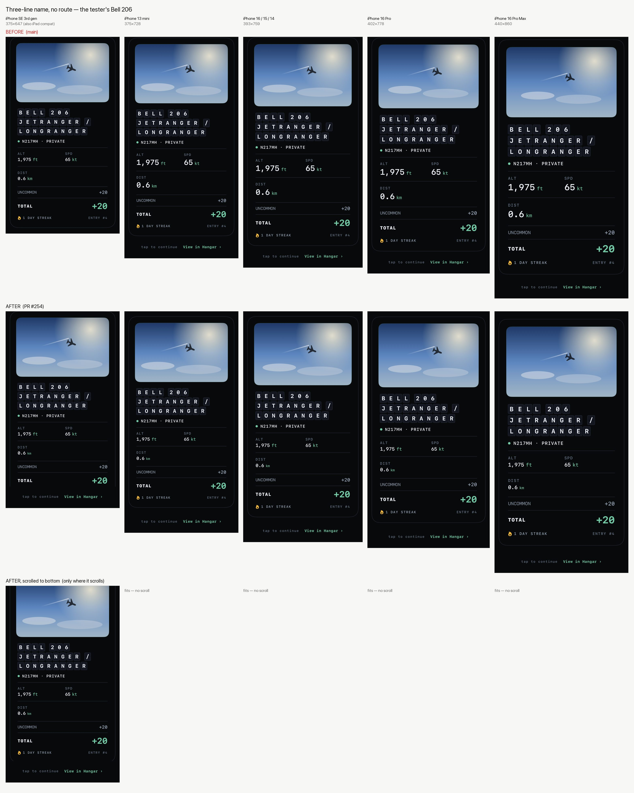
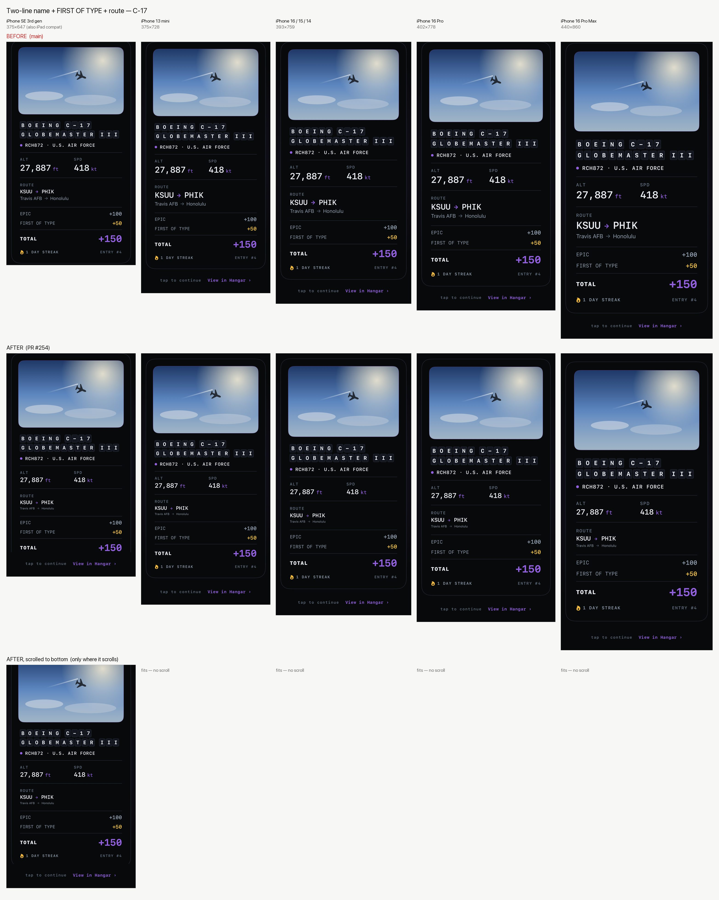
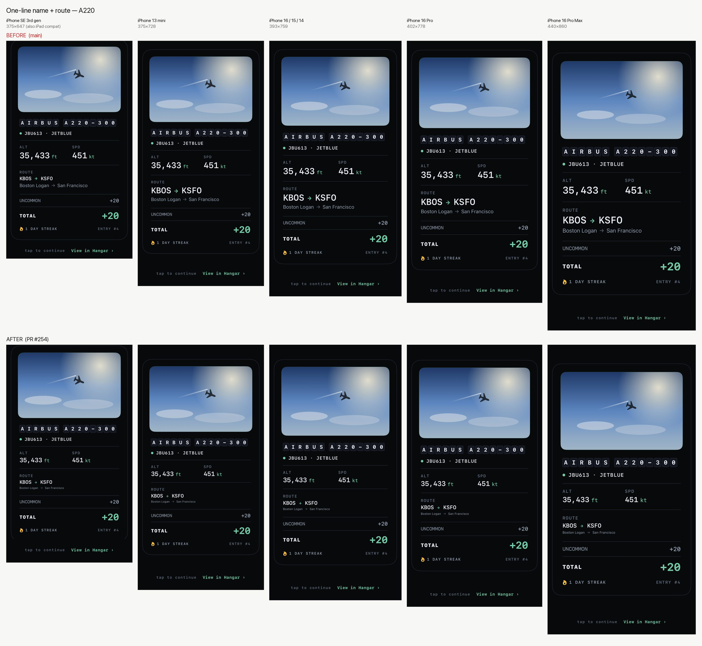
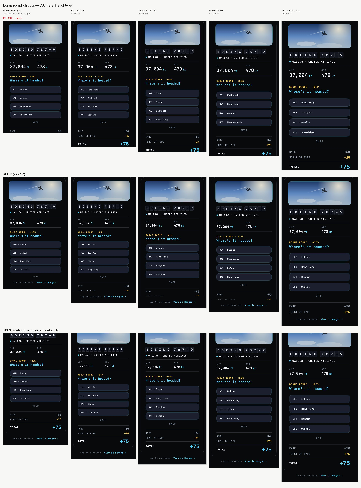

# Catch reveal on short screens — device × configuration matrix (PR #254)

Live `CatchRevealView` hosted in a `UIWindow` at each device's **portrait
safe-area size** (points), rendered by `RevealDeviceMatrixRenderTests`
(`TEST_RUNNER_TAILSPOT_MATRIX=before|after xcodebuild test …`). "Before" is
`main` at a83c6c8; "after" is this branch. Columns, left → right: iPhone SE
3rd gen 375×647 (an iPad running the iPhone app in compatibility mode gets the
same window), iPhone 13 mini 375×728, iPhone 16/15/14 393×759, iPhone 16 Pro
402×778, iPhone 16 Pro Max 440×860. The third row appears only where the new
layout actually scrolls.

How to read it: the card is laid out at the same compressed size it always had
(the old column always squeezed the route text and readouts to their minimum
scale), so a card that fit before is pixel-identical after. Only a card that
still overflows scrolls, with the CTA strip pinned below it. "After" differs
from "before" only in the cells that were already broken.

| Configuration | Before | After |
| --- | --- | --- |
| Three-line name, no route (the tester's Bell 206) | SE: card fills the screen, CTA strip entirely below the edge — no way to proceed. Tall phones: fits. | SE: card scrolls, "tap to continue / View in Hangar" pinned. Tall phones: identical to before (no scroll). |
| |  | |
| Two-line name + FIRST OF TYPE + route (C-17) | SE: CTA clipped. Tall phones: fits. | SE: scrolls with CTA pinned. Tall phones: identical. |
| |  | |
| One-line name + route (A220) | Fits everywhere, ~20 pt to spare on the SE. | Identical everywhere. |
| |  | |
| Bonus round, chips up (787, rare + first of type) | The chips card is taller than every phone's safe area, the 16 Pro Max included: the CTA was off-screen for the whole round on every device, the ledger cut, and on the SE the last chip and SKIP were unreachable. | Scrolls on every device, CTA pinned; chips, SKIP and the ledger reachable everywhere. The card's height itself is pre-existing and not changed here. |
| |  | |
